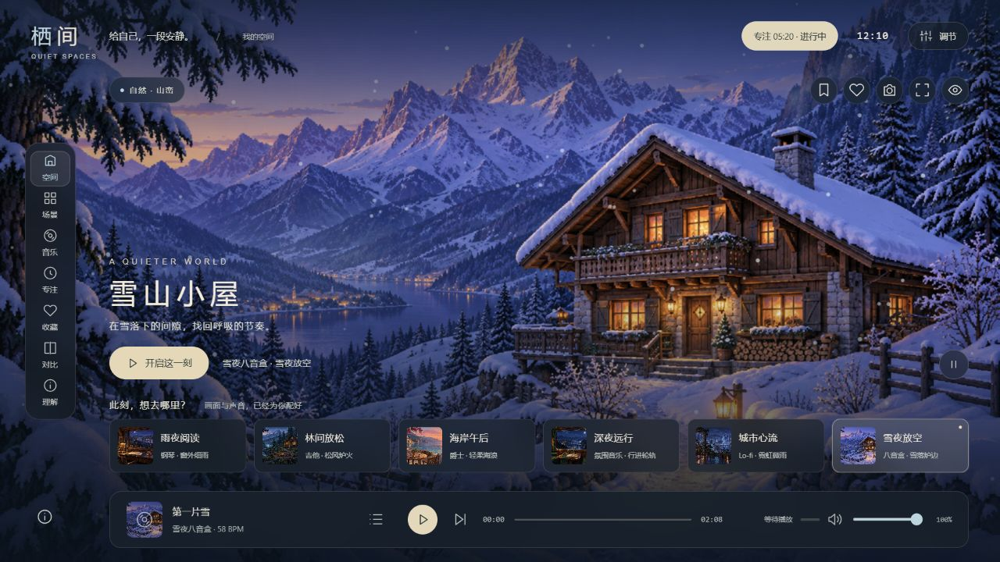

# GitHub 项目研究索引

记录值得深入研究的 GitHub 项目与交互网页：为什么值得看、如何运行、关键实现，以及实际体验与可复用的结论。仅有网页参考时明确记录来源类型，不推定其源码开源。

这是一个持续更新的研究总仓库。首页提供摘要和有序入口；每个子项目独立保存研究笔记、代码实验、截图及 Web 演示说明。

[子项目目录](projects/) · [新增项目与维护约定](docs/CONVENTIONS.md) · [Web 演示部署规划](docs/DEPLOYMENT.md)

## 项目索引

编号从 `001` 开始，创建后保持不变；默认按编号顺序展示，也可通过 `order` 调整展示顺序。

<!-- PROJECTS:START -->
当前收录 **1** 个项目。

| 编号 | 项目与研究入口 | 摘要 | 研究状态 | 参考来源 | Web 演示 |
| --- | --- | --- | --- | --- | --- |
| 003 | [Lofi Cities](projects/003-lofi-cities/README.md) | 能力：动态城市、实时合成音乐与环境混音；效果：可调节的沉浸氛围；场景：阅读、工作、放松；扩展：物件联动、时间变化与空间分享；对我：用独立产品“栖间”验证可保存、可交互的个人环境。 | 已完成 | [Lofi Cities · Istanbul](https://loficities.com/istanbul/) | — |

### 项目图片

#### 003 · Lofi Cities

[](projects/003-lofi-cities/README.md)

栖间实际网页产品引导图：雪山动态场景、六套氛围组合、左侧功能导航、环境调节与底部音乐播放器；这是独立实现的演示，不是源站截图。

能力：动态城市、实时合成音乐与环境混音；效果：可调节的沉浸氛围；场景：阅读、工作、放松；扩展：物件联动、时间变化与空间分享；对我：用独立产品“栖间”验证可保存、可交互的个人环境。
<!-- PROJECTS:END -->

## 开始一项研究

需要 Python 3.10 或更新版本，无需安装第三方依赖。在仓库根目录运行以下命令，将示例信息替换为实际项目：

```sh
python scripts/projects.py new example-project --name "项目名称" --source "https://github.com/owner/repo" --summary "一句话说明研究价值"
```

命令会创建 `projects/001-example-project/` 并更新首页。之后在子项目中填写研究内容、添加截图；修改 `project.json` 后运行：

```sh
python scripts/projects.py sync
python scripts/projects.py check
```

## 内容组织

```text
.
├── README.md                   # 对外摘要、有序索引、项目图片
├── projects/                   # 001-name、002-name……各自独立
├── templates/project/          # 子项目文档、笔记、图片及 Web 模板
├── docs/                       # 维护约定与多 Web 部署规划
├── scripts/projects.py         # 新建项目、更新与检查首页索引
└── .github/workflows/check.yml  # 自动检查项目元数据与首页同步情况
```

研究状态使用：**待研究 → 研究中 → 已完成**，暂缓的项目标记为 **已归档** 并保留编号。演示是否上线由单独的链接体现。

## 来源与复用

每项研究记录上游仓库、所研究的版本或提交及许可证信息。引用的代码、图片和文档保留来源说明；本仓库的整理不改变上游项目的许可证。
