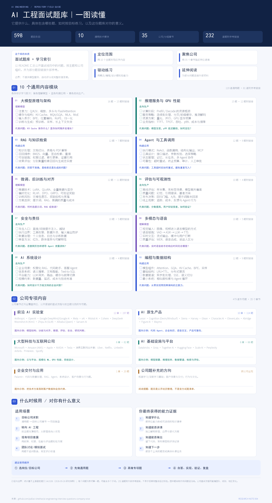
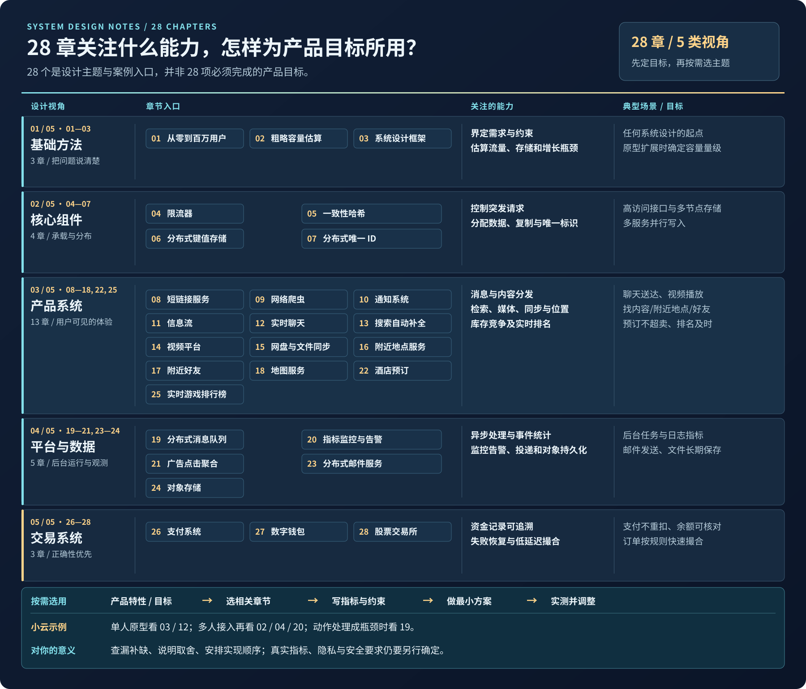
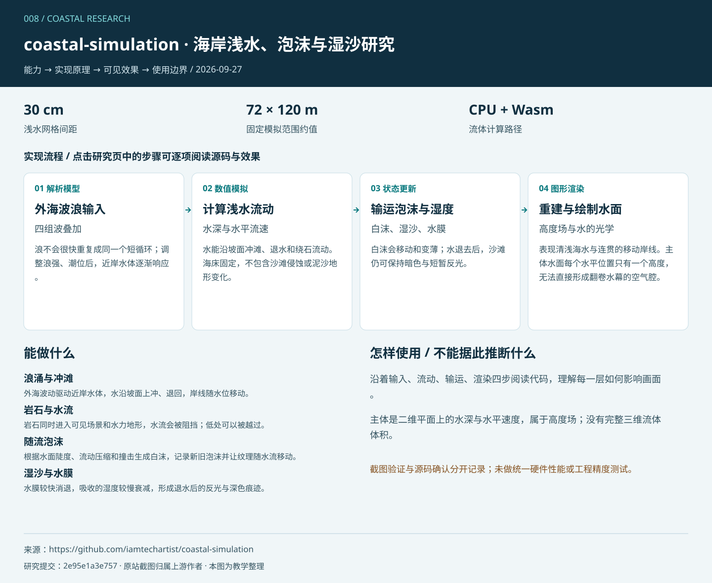
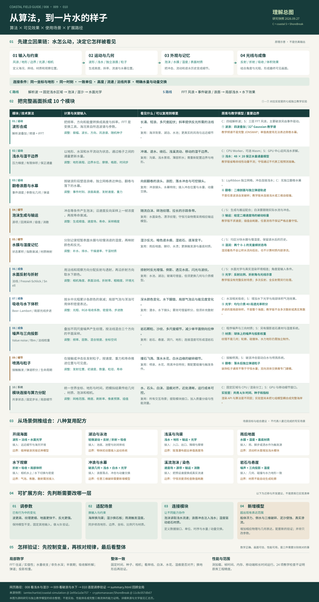
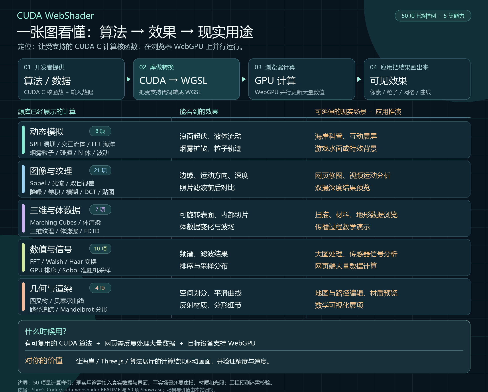
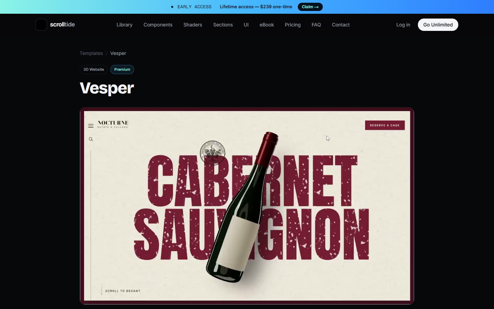

# GitHub 项目研究索引

记录值得深入研究的 GitHub 项目与交互网页：为什么值得看、如何运行、关键实现，以及实际体验与可复用的结论。仅有网页参考时明确记录来源类型，不推定其源码开源。

这是一个持续更新的研究总仓库。首页提供摘要和有序入口；每个子项目独立保存研究笔记、代码实验、截图及 Web 演示说明。

[子项目目录](projects/) · [新增项目与维护约定](docs/CONVENTIONS.md) · [Web 演示部署规划](docs/DEPLOYMENT.md)

专题汇总：[水面算法、效果与场景](projects/010-algorithm-scene-lab/notes/synthesis.md) · [完整引导图](projects/010-algorithm-scene-lab/assets/water-algorithm-map.svg)。本专题包含 coastal-simulation、ShoreBreak 与独立算法实验室，按效果、内部模块、使用场景、可扩展产品方向和个人价值整理。

## 项目索引

编号从 `001` 开始，创建后保持不变；默认按编号顺序展示，也可通过 `order` 调整展示顺序。

<!-- PROJECTS:START -->
当前收录 **13** 个项目。

| 编号 | 项目与研究入口 | 摘要 | 研究状态 | 参考来源 | Web 演示 |
| --- | --- | --- | --- | --- | --- |
| 001 | [西安夜行图](projects/001-xian-night-atlas/README.md) | <strong>能力：</strong>参考東京終電図的三维线网与时间轴，我们以西安演示返程和可达范围计算<br><strong>呈现效果：</strong>夜景线路按末班时刻抬升，时间推进时区段渐暗、可达站点发光<br><strong>使用场景：</strong>交通网络研究、活动散场和夜游信息展示，当前仅为模拟原型<br><strong>可扩展方向：</strong>景点关联主题路线与步行导览、场馆接驳、园区夜班交通<br><strong>对我的意义：</strong>沉淀可复用的时空交互与路线计算方法，验证具体业务需求。 | 已完成 | [東京終電図](https://tokyo-last-train.matodesign.workers.dev/) | [在线体验](https://yydshly.github.io/0927_codex_project/001-xian-night-atlas/) |
| 002 | [FreeMoCap 动作实验室](projects/002-freemocap-lab/README.md) | <strong>能力：</strong>从同步多视角视频重建真人三维骨架与动作数据<br><strong>呈现效果：</strong>骨架回放、关节轨迹及数据导出，本页提供合成回放与重建实验<br><strong>使用场景：</strong>动画素材、运动教学、科研、体感交互与动作数据集<br><strong>可扩展方向：</strong>质量评估、批处理、角色重定向与统一动作库<br><strong>对我的意义：</strong>为“小云”采集专属真人表演，与 Kimodo 生成动作共同进入角色动作库。 | 已完成 | [FreeMoCap](https://github.com/freemocap/freemocap) | [在线体验](https://yydshly.github.io/0927_codex_project/002-freemocap-lab/#capabilities) |
| 003 | [Lofi Cities](projects/003-lofi-cities/README.md) | <strong>能力：</strong>动态城市、实时合成音乐与环境混音<br><strong>效果：</strong>可调节的沉浸氛围<br><strong>场景：</strong>阅读、工作、放松<br><strong>扩展：</strong>物件联动、时间变化与空间分享<br><strong>对我：</strong>用独立产品“栖间”验证可保存、可交互的个人环境。 | 已完成 | [Lofi Cities · Istanbul](https://loficities.com/istanbul/) | [在线体验](https://yydshly.github.io/0927_codex_project/003-lofi-cities/) |
| 004 | [AI 工程面试题库研究](projects/004-ai-engineering-interview-guide/README.md) | <strong>能力：</strong>这是按技术主题和公司组织的 AI 工程面试题库与学习索引，可用于定位知识范围、练习解释原理和分析工程取舍<br><strong>内容：</strong>固定版本收录 598 道题，包含 10 个通用模块的 119 题和 35 个公司或分组章节的 479 题，232 题附外部参考链接，本站为 45 题补充中文答题要点<br><strong>使用场景：</strong>目标公司求职、转向 AI 工程、现有项目查漏补缺、同伴模拟面试与团队讨论<br><strong>对我的意义：</strong>把岗位要求转成可练习的题目清单，用自答、实现、验证和复盘发现薄弱项，形成能解释也能动手的能力证据。 | 已完成 | [ai-engineering-interview-questions-company-wise](https://github.com/pallavi-shekhar/ai-engineering-interview-questions-company-wise) | [在线体验](https://yydshly.github.io/0927_codex_project/004-ai-engineering-interview-guide/#overview) |
| 005 | [Jailbreaks 越狱提示词库研究](projects/005-jailbreaks-research/README.md) | <strong>能力：</strong>收录面向 10 组模型或系列的 23 份越狱提示词与配置样本，尝试改变内容边界和拒绝条件<br><strong>呈现效果：</strong>可能实质越界、表面顺从或继续拒绝，网页用完整引导图展示机制与证据，成功率未实测<br><strong>使用场景：</strong>理解受限请求的拒绝机制，对自有模型系统开展授权防护评估<br><strong>可扩展方向：</strong>样本版本管理、跨模型对照评测、误拒绝与稳定性记录<br><strong>对我的意义：</strong>判断越狱是否可能改变拒绝，区分回答行为与真实权限，也明确它不能替代无人机系统的工程实现。 | 已完成 | [jailbreaks](https://github.com/togg53192-cmd/jailbreaks) | [在线体验](https://yydshly.github.io/0927_codex_project/005-jailbreaks-research/#overview) |
| 006 | [Three\.js 能力与 GPU 渲染研究](projects/006-threejs-gpu-rasterizer/README.md) | <strong>能力：</strong>three\.js 提供网页三维场景、模型材质、光照、交互、动画及 WebXR/WebGPU 扩展；PR \#33605 探索超大几何场景的 GPU 驱动绘制<br><strong>呈现效果：</strong>完整理解总图、六类官方示例入口，以及 144 台模拟风机的可交互巡检与精度策略对比<br><strong>使用场景：</strong>产品展示、工业设备巡检、BIM 工程审阅、城市与扫描资产浏览<br><strong>技术原理：</strong>three\.js 组织场景并交给 WebGL/WebGPU 渲染；PR 将几何分组，GPU 做视锥筛选和屏幕误差 LOD，再以软件与硬件路径绘制并给可见像素上色<br><strong>可扩展方向：</strong>真实模型导入、自动分块与多档精度、按需加载、设备数据接入、协同巡检及性能基准<br><strong>对我的意义：</strong>先用 three\.js 验证三维产品体验，再根据真实模型和设备测试决定是否采用 PR 的深度优化路线。 | 已完成 | [three\.js](https://github.com/mrdoob/three.js) | [在线体验](https://yydshly.github.io/0927_codex_project/006-threejs-gpu-rasterizer/#map) |
| 007 | [系统设计笔记能力研究](projects/007-system-design-notes/README.md) | <strong>能力：</strong>以需求、规模、故障和数据正确性为线索，分析系统方案与取舍<br><strong>呈现效果：</strong>上游是学习笔记而非可运行系统，本站用 28 章总图、可检索导读、目标对照和小云容量演示呈现设计思路<br><strong>内容：</strong>上游根据 Alex Xu《系统设计访谈——内幕指南》（System Design Interview – An Insider's Guide）第 1、2 卷整理 28 章社区学习笔记，并非原书全文；本站将章节分为基础方法 3、核心组件 4、产品系统 13、平台与数据 5、交易系统 3 类<br><strong>使用场景：</strong>系统设计学习与面试、产品立项、后端方案评审、扩容和故障复盘<br><strong>可扩展方向：</strong>按需探索 AI 互动角色、动作与媒体素材库、空间与附近体验、预约交易及运营观测<br><strong>对我的意义：</strong>把现有 AI 与交互原型转成可验证的目标、容量指标和演进顺序，不必照搬全部章节。 | 已完成 | [system-design-notes](https://github.com/liquidslr/system-design-notes) | [在线体验](https://yydshly.github.io/0927_codex_project/007-system-design-notes/#overview) |
| 008 | [coastal-simulation 海岸浅水研究](projects/008-coastal-simulation/README.md) | <strong>呈现效果：</strong>连续的海岸浪涌、绕石白沫、冲滩回流、浅水透明度、湿沙反光与接触水花，重点呈现水流和地面的连贯变化。<br><strong>内部模块：</strong>四组解析波、固定网格浅水、泡沫生成与输运、水膜与湿度、光学与程序材质、喷溅、环境及相机；Worker 与可选 Wasm 负责流动计算。<br><strong>使用场景：</strong>海岸视觉展示、图形算法教学、景观水体原型、浅水与湿润材质研究。<br><strong>可扩展产品方向：</strong>可开发可调海岸展厅、浅水效果组件、湿地表材质编辑器或交互教学课程；需补齐模块接口、场景导入、预设管理和设备适配。<br><strong>对我的意义：</strong>看懂浪、水流、泡沫、湿痕与光线怎样连接，形成可带到湖池、沟渠和雨后地面的算法复用方法。 | 已完成 | [coastal-simulation](https://github.com/iamtechartist/coastal-simulation) | [在线体验](https://yydshly.github.io/0927_codex_project/008-coastal-simulation/#overview) |
| 009 | [ShoreBreak 破浪与水下研究](projects/009-shorebreak/README.md) | <strong>呈现效果：</strong>多尺度海浪、向前翻卷的水幕与浪腔、落水白沫、精细冲滩、湿岩石以及水下气泡与朦胧感；强调近景破浪与漫游。<br><strong>内部模块：</strong>三层 FFT 风浪、事件破浪、独立浪唇网格、GPU 浅水、白水与喷溅、地形和湿度、水面与水下光学、行走游泳及质量控制。<br><strong>使用场景：</strong>沉浸海岸互动、冲浪视觉镜头、水下体验、游戏与景观场景预演、图形学学习。<br><strong>可扩展产品方向：</strong>可开发海岸漫游展厅、可控破浪镜头工具、水下视觉组件或效果调试台；需完善资产许可、模块接口、编辑器、触控与设备分级。<br><strong>对我的意义：</strong>理解高度场、独立几何、粒子和局部体积各自的能力边界，学会按目标拆分系统、连接状态并评估移植成本。 | 已完成 | [ShoreBreak](https://github.com/cryptomanavan/ShoreBreak) | [在线体验](https://yydshly.github.io/0927_codex_project/009-shorebreak/#overview) |
| 010 | [算法与场景实验室](projects/010-algorithm-scene-lab/README.md) | <strong>呈现效果：</strong>把海岸水面拆成七组可调的 A/B 教学画面，配合实时数值、历史曲线和总图解释变化原因；原库真实效果另设研究页。<br><strong>内部模块：</strong>波浪、浅水、输运、湿度、光学、翻卷与喷溅、噪声与三向投影；配套八个场景入口、参数与时间管理、24 项局部检查、链接和记录导出。<br><strong>使用场景：</strong>水面算法学习、参数对照、效果原型验证、海岸与湖池及雨后地面等场景的模块选型与复用评估。<br><strong>可扩展产品方向：</strong>图形学交互课程、水效果参数与素材编辑器、沉浸海岸展示、场景视觉预演工具；需继续接入课程管理、GPU 材质、模块接口和设备适配。<br><strong>对我的意义：</strong>建立从场景目标到算法组合、参数验证和模块复用的判断方法，区分调参数、适配场景、连接模块与新增模型，沉淀自己的三维交互知识资产。 | 已完成 | [coastal-simulation（另参照 ShoreBreak）](https://github.com/iamtechartist/coastal-simulation) | [在线体验](https://yydshly.github.io/0927_codex_project/010-algorithm-scene-lab/summary.html) |
| 011 | [CUDA WebShader 能力与效果展厅](projects/011-cuda-webshader/README.md) | <strong>能力：</strong>将受支持的 CUDA C 核函数转成 WGSL，并在浏览器用 WebGPU 运行<br><strong>呈现效果：</strong>上游 50 项样例展示海浪、流体粒子、图像处理、三维体数据、路径追踪和数值结果，本站 12 个 Canvas 画面是解释性样机<br><strong>内部模块：</strong>CUDA 前端与 WGSL 生成器、WebGPU 运行时与 Three\.js 缓冲区桥接、Sandbox 和 Kernel Lab、样例及验证<br><strong>内部算法：</strong>动态模拟 8、图像纹理 21、三维体数据 7、数值信号 10、几何渲染 4<br><strong>使用场景：</strong>网页端大量重复计算的交互展示、图像和扫描数据处理、算法教学与原生 CUDA 结果对照<br><strong>可扩展产品方向：</strong>GPU 算法工作台、交互视觉组件、图像分析工具和三维数据浏览器，均需补齐数据、界面与验证<br><strong>对我的意义：</strong>把 Three\.js 呈现与海岸、粒子等模型的 GPU 计算连接起来，并用固定输入比较精度、速度和设备适配后再决定是否采用。 | 已完成 | [CUDA WebShader](https://github.com/SamG-Coder/cuda-webshader) | [在线体验](https://yydshly.github.io/0927_codex_project/011-cuda-webshader/#capability-map) |
| 012 | [coastal-simulation GPU 海岸能力研究](projects/012-coastal-simulation-cuda-webshader/README.md) | <strong>能力：</strong>模拟海浪与固定岩石、海床和岸线的浅水接触，水受阻后分流、绕石、冲滩和退回，岩石不会被水推动<br><strong>呈现效果：</strong>浪涌、白沫、细波、撞击喷雾与退水后的湿沙湿岩石会连续变化<br><strong>内部模块：</strong>地形和来浪、浅水求解、破浪湍流与泡沫、水面短波与重建、湿润和喷溅、材质光照、GPU 调度与相机诊断<br><strong>内部算法：</strong>交错网格浅水更新、动量平流、保正水量通量与湿干处理、泡沫输运衰减、定向短波、法线与 GGX 高光、喷溅粒子更新；CUDA WebShader 将 CUDA 源编为 WGSL，经 WebGPU 计算并由 Three\.js 绘制<br><strong>使用场景：</strong>互动海岸网页和展陈、浅水与图形学教学、GPU 数据管线研究<br><strong>可扩展产品方向：</strong>可保存的海岸场景编辑器、可嵌入的互动海岸组件、算法教学实验台，仍需自由地形接入和设备适配<br><strong>对我的意义：</strong>看懂从水流方程到可见画面的完整路径，在源库真实三维效果上逐步制作自己的海岸场景。 | 已完成 | [coastal-simulation-cuda-webshader](https://github.com/SamG-Coder/coastal-simulation-cuda-webshader) | [在线体验](https://yydshly.github.io/0927_codex_project/012-coastal-simulation-cuda-webshader/#overview) |
| 013 | [Scrolltide 三维展示与动效实验室](projects/013-scrolltide-motion-lab/README.md) | <strong>能力：</strong>研究 Scrolltide 的三维与电影感网页展示，并以六个原创可操作场景比较视频、逐帧 Canvas、Three\.js、混合叠层、CSS 3D 和 Shader<br><strong>呈现效果：</strong>金雕迎面飞来、腕表随滚动推进、可转动酒瓶、战机悬于航拍画面、空间卡片和流动光场<br><strong>内部模块：</strong>源站真实样例引导、六种动效实验、操作与状态说明、技术选型<br><strong>内部算法：</strong>本项目使用时间轴与帧索引映射、三维模型与相机实时渲染、图层合成、透视变换和逐像素着色，不推断源站未公开的实现<br><strong>使用场景：</strong>产品发布页、品牌叙事、作品集、互动展陈与网页动效教学<br><strong>可扩展产品方向：</strong>可复用三维商品展示器、滚动叙事组件、模板选型工具与性能自适应动效系统<br><strong>对我的意义：</strong>看懂视觉效果背后的实现路线和制作成本，为自己的三维展示产品选择合适技术。 | 已完成 | [Scrolltide](https://www.scrolltide.co/) | [在线体验](https://yydshly.github.io/0927_codex_project/013-scrolltide-motion-lab/#source-gallery) |

### 项目图片

#### 001 · 西安夜行图

[](projects/001-xian-night-atlas/README.md)

西安夜行图实际产品截图引导图：桌面三维可达地图、手机返程计划及能力、效果、场景、扩展和个人价值。

<strong>能力：</strong>参考東京終電図的三维线网与时间轴，我们以西安演示返程和可达范围计算

<strong>呈现效果：</strong>夜景线路按末班时刻抬升，时间推进时区段渐暗、可达站点发光

<strong>使用场景：</strong>交通网络研究、活动散场和夜游信息展示，当前仅为模拟原型

<strong>可扩展方向：</strong>景点关联主题路线与步行导览、场馆接驳、园区夜班交通

<strong>对我的意义：</strong>沉淀可复用的时空交互与路线计算方法，验证具体业务需求。

#### 002 · FreeMoCap 动作实验室

[](projects/002-freemocap-lab/README.md)

FreeMoCap 完整能力引导图：输入、摄像头条件、重建原理、输出、角色驱动、使用场景、小云项目价值与能力边界；研究示意，非实拍结果。

<strong>能力：</strong>从同步多视角视频重建真人三维骨架与动作数据

<strong>呈现效果：</strong>骨架回放、关节轨迹及数据导出，本页提供合成回放与重建实验

<strong>使用场景：</strong>动画素材、运动教学、科研、体感交互与动作数据集

<strong>可扩展方向：</strong>质量评估、批处理、角色重定向与统一动作库

<strong>对我的意义：</strong>为“小云”采集专属真人表演，与 Kimodo 生成动作共同进入角色动作库。

#### 003 · Lofi Cities

[](projects/003-lofi-cities/README.md)

栖间实际网页产品引导图：雪山动态场景、六套氛围组合、左侧功能导航、环境调节与底部音乐播放器；这是独立实现的演示，不是源站截图。

<strong>能力：</strong>动态城市、实时合成音乐与环境混音

<strong>效果：</strong>可调节的沉浸氛围

<strong>场景：</strong>阅读、工作、放松

<strong>扩展：</strong>物件联动、时间变化与空间分享

<strong>对我：</strong>用独立产品“栖间”验证可保存、可交互的个人环境。

#### 004 · AI 工程面试题库研究

[](projects/004-ai-engineering-interview-guide/README.md)

AI 工程面试题库完整引导图：题库能力、10 个内容模块、35 个公司章节、使用场景、个人价值与练习顺序。

<strong>能力：</strong>这是按技术主题和公司组织的 AI 工程面试题库与学习索引，可用于定位知识范围、练习解释原理和分析工程取舍

<strong>内容：</strong>固定版本收录 598 道题，包含 10 个通用模块的 119 题和 35 个公司或分组章节的 479 题，232 题附外部参考链接，本站为 45 题补充中文答题要点

<strong>使用场景：</strong>目标公司求职、转向 AI 工程、现有项目查漏补缺、同伴模拟面试与团队讨论

<strong>对我的意义：</strong>把岗位要求转成可练习的题目清单，用自答、实现、验证和复盘发现薄弱项，形成能解释也能动手的能力证据。

#### 005 · Jailbreaks 越狱提示词库研究

[](projects/005-jailbreaks-research/README.md)

Jailbreaks 完整引导图：10 组模型或系列、越狱目标、规则遵循原理、可能效果及个人价值；模型效果未实测。

<strong>能力：</strong>收录面向 10 组模型或系列的 23 份越狱提示词与配置样本，尝试改变内容边界和拒绝条件

<strong>呈现效果：</strong>可能实质越界、表面顺从或继续拒绝，网页用完整引导图展示机制与证据，成功率未实测

<strong>使用场景：</strong>理解受限请求的拒绝机制，对自有模型系统开展授权防护评估

<strong>可扩展方向：</strong>样本版本管理、跨模型对照评测、误拒绝与稳定性记录

<strong>对我的意义：</strong>判断越狱是否可能改变拒绝，区分回答行为与真实权限，也明确它不能替代无人机系统的工程实现。

#### 006 · Three\.js 能力与 GPU 渲染研究

[](projects/006-threejs-gpu-rasterizer/README.md)

Three\.js 与 GPU 驱动渲染理解总图：区分基础库、官方示例与 PR \#33605，概括能力、技术原理、呈现效果、使用场景、产品方向和个人价值。

<strong>能力：</strong>three\.js 提供网页三维场景、模型材质、光照、交互、动画及 WebXR/WebGPU 扩展；PR \#33605 探索超大几何场景的 GPU 驱动绘制

<strong>呈现效果：</strong>完整理解总图、六类官方示例入口，以及 144 台模拟风机的可交互巡检与精度策略对比

<strong>使用场景：</strong>产品展示、工业设备巡检、BIM 工程审阅、城市与扫描资产浏览

<strong>技术原理：</strong>three\.js 组织场景并交给 WebGL/WebGPU 渲染；PR 将几何分组，GPU 做视锥筛选和屏幕误差 LOD，再以软件与硬件路径绘制并给可见像素上色

<strong>可扩展方向：</strong>真实模型导入、自动分块与多档精度、按需加载、设备数据接入、协同巡检及性能基准

<strong>对我的意义：</strong>先用 three\.js 验证三维产品体验，再根据真实模型和设备测试决定是否采用 PR 的深度优化路线。

#### 007 · 系统设计笔记能力研究

[](projects/007-system-design-notes/README.md)

系统设计笔记 28 章能力与场景总图：按五类主题展示章节、关注能力、典型目标，以及根据产品特性按需选用的路径。

<strong>能力：</strong>以需求、规模、故障和数据正确性为线索，分析系统方案与取舍

<strong>呈现效果：</strong>上游是学习笔记而非可运行系统，本站用 28 章总图、可检索导读、目标对照和小云容量演示呈现设计思路

<strong>内容：</strong>上游根据 Alex Xu《系统设计访谈——内幕指南》（System Design Interview – An Insider's Guide）第 1、2 卷整理 28 章社区学习笔记，并非原书全文；本站将章节分为基础方法 3、核心组件 4、产品系统 13、平台与数据 5、交易系统 3 类

<strong>使用场景：</strong>系统设计学习与面试、产品立项、后端方案评审、扩容和故障复盘

<strong>可扩展方向：</strong>按需探索 AI 互动角色、动作与媒体素材库、空间与附近体验、预约交易及运营观测

<strong>对我的意义：</strong>把现有 AI 与交互原型转成可验证的目标、容量指标和演进顺序，不必照搬全部章节。

#### 008 · coastal-simulation 海岸浅水研究

[](projects/008-coastal-simulation/README.md)

coastal-simulation 能力与原理总图：模型分工、可见效果、使用场景和边界；教学整理，非模拟输出。

<strong>呈现效果：</strong>连续的海岸浪涌、绕石白沫、冲滩回流、浅水透明度、湿沙反光与接触水花，重点呈现水流和地面的连贯变化。

<strong>内部模块：</strong>四组解析波、固定网格浅水、泡沫生成与输运、水膜与湿度、光学与程序材质、喷溅、环境及相机；Worker 与可选 Wasm 负责流动计算。

<strong>使用场景：</strong>海岸视觉展示、图形算法教学、景观水体原型、浅水与湿润材质研究。

<strong>可扩展产品方向：</strong>可开发可调海岸展厅、浅水效果组件、湿地表材质编辑器或交互教学课程；需补齐模块接口、场景导入、预设管理和设备适配。

<strong>对我的意义：</strong>看懂浪、水流、泡沫、湿痕与光线怎样连接，形成可带到湖池、沟渠和雨后地面的算法复用方法。

#### 009 · ShoreBreak 破浪与水下研究

[](projects/009-shorebreak/README.md)

ShoreBreak 能力与原理总图：模型分工、可见效果、使用场景和边界；教学整理，非模拟输出。

<strong>呈现效果：</strong>多尺度海浪、向前翻卷的水幕与浪腔、落水白沫、精细冲滩、湿岩石以及水下气泡与朦胧感；强调近景破浪与漫游。

<strong>内部模块：</strong>三层 FFT 风浪、事件破浪、独立浪唇网格、GPU 浅水、白水与喷溅、地形和湿度、水面与水下光学、行走游泳及质量控制。

<strong>使用场景：</strong>沉浸海岸互动、冲浪视觉镜头、水下体验、游戏与景观场景预演、图形学学习。

<strong>可扩展产品方向：</strong>可开发海岸漫游展厅、可控破浪镜头工具、水下视觉组件或效果调试台；需完善资产许可、模块接口、编辑器、触控与设备分级。

<strong>对我的意义：</strong>理解高度场、独立几何、粒子和局部体积各自的能力边界，学会按目标拆分系统、连接状态并评估移植成本。

#### 010 · 算法与场景实验室

[](projects/010-algorithm-scene-lab/README.md)

统一理解总图：水面因果链、十个模块、八种场景配方、四级扩展与验证；区分原库能力、教学模型和后续开发建议。

<strong>呈现效果：</strong>把海岸水面拆成七组可调的 A/B 教学画面，配合实时数值、历史曲线和总图解释变化原因；原库真实效果另设研究页。

<strong>内部模块：</strong>波浪、浅水、输运、湿度、光学、翻卷与喷溅、噪声与三向投影；配套八个场景入口、参数与时间管理、24 项局部检查、链接和记录导出。

<strong>使用场景：</strong>水面算法学习、参数对照、效果原型验证、海岸与湖池及雨后地面等场景的模块选型与复用评估。

<strong>可扩展产品方向：</strong>图形学交互课程、水效果参数与素材编辑器、沉浸海岸展示、场景视觉预演工具；需继续接入课程管理、GPU 材质、模块接口和设备适配。

<strong>对我的意义：</strong>建立从场景目标到算法组合、参数验证和模块复用的判断方法，区分调参数、适配场景、连接模块与新增模型，沉淀自己的三维交互知识资产。

#### 011 · CUDA WebShader 能力与效果展厅

[](projects/011-cuda-webshader/README.md)

CUDA WebShader 一图总览：从 CUDA 算法经 WGSL 和 WebGPU 计算到可见效果；汇总五类共 50 个上游样例、现实用途推演、适用条件与个人价值。

<strong>能力：</strong>将受支持的 CUDA C 核函数转成 WGSL，并在浏览器用 WebGPU 运行

<strong>呈现效果：</strong>上游 50 项样例展示海浪、流体粒子、图像处理、三维体数据、路径追踪和数值结果，本站 12 个 Canvas 画面是解释性样机

<strong>内部模块：</strong>CUDA 前端与 WGSL 生成器、WebGPU 运行时与 Three\.js 缓冲区桥接、Sandbox 和 Kernel Lab、样例及验证

<strong>内部算法：</strong>动态模拟 8、图像纹理 21、三维体数据 7、数值信号 10、几何渲染 4

<strong>使用场景：</strong>网页端大量重复计算的交互展示、图像和扫描数据处理、算法教学与原生 CUDA 结果对照

<strong>可扩展产品方向：</strong>GPU 算法工作台、交互视觉组件、图像分析工具和三维数据浏览器，均需补齐数据、界面与验证

<strong>对我的意义：</strong>把 Three\.js 呈现与海岸、粒子等模型的 GPU 计算连接起来，并用固定输入比较精度、速度和设备适配后再决定是否采用。

#### 012 · coastal-simulation GPU 海岸能力研究

[](projects/012-coastal-simulation-cuda-webshader/README.md)

GPU 海岸模拟库完整能力总图：水与固定岩石、地形的互动、内部算法、可见效果、场景和个人价值；海岸配图为生成示意，012 页面另附源库实拍。

<strong>能力：</strong>模拟海浪与固定岩石、海床和岸线的浅水接触，水受阻后分流、绕石、冲滩和退回，岩石不会被水推动

<strong>呈现效果：</strong>浪涌、白沫、细波、撞击喷雾与退水后的湿沙湿岩石会连续变化

<strong>内部模块：</strong>地形和来浪、浅水求解、破浪湍流与泡沫、水面短波与重建、湿润和喷溅、材质光照、GPU 调度与相机诊断

<strong>内部算法：</strong>交错网格浅水更新、动量平流、保正水量通量与湿干处理、泡沫输运衰减、定向短波、法线与 GGX 高光、喷溅粒子更新；CUDA WebShader 将 CUDA 源编为 WGSL，经 WebGPU 计算并由 Three\.js 绘制

<strong>使用场景：</strong>互动海岸网页和展陈、浅水与图形学教学、GPU 数据管线研究

<strong>可扩展产品方向：</strong>可保存的海岸场景编辑器、可嵌入的互动海岸组件、算法教学实验台，仍需自由地形接入和设备适配

<strong>对我的意义：</strong>看懂从水流方程到可见画面的完整路径，在源库真实三维效果上逐步制作自己的海岸场景。

#### 013 · Scrolltide 三维展示与动效实验室

[](projects/013-scrolltide-motion-lab/README.md)

Scrolltide 源站 Vesper 样例页面截图：居中的酒瓶展示与酒红色大标题；网页内另有四张源站样例截图。

<strong>能力：</strong>研究 Scrolltide 的三维与电影感网页展示，并以六个原创可操作场景比较视频、逐帧 Canvas、Three\.js、混合叠层、CSS 3D 和 Shader

<strong>呈现效果：</strong>金雕迎面飞来、腕表随滚动推进、可转动酒瓶、战机悬于航拍画面、空间卡片和流动光场

<strong>内部模块：</strong>源站真实样例引导、六种动效实验、操作与状态说明、技术选型

<strong>内部算法：</strong>本项目使用时间轴与帧索引映射、三维模型与相机实时渲染、图层合成、透视变换和逐像素着色，不推断源站未公开的实现

<strong>使用场景：</strong>产品发布页、品牌叙事、作品集、互动展陈与网页动效教学

<strong>可扩展产品方向：</strong>可复用三维商品展示器、滚动叙事组件、模板选型工具与性能自适应动效系统

<strong>对我的意义：</strong>看懂视觉效果背后的实现路线和制作成本，为自己的三维展示产品选择合适技术。
<!-- PROJECTS:END -->

## 开始一项研究

需要 Python 3.10 或更新版本，无需安装第三方依赖。在仓库根目录运行以下命令，将示例信息替换为实际项目：

```sh
python scripts/projects.py new example-project --name "项目名称" --source "https://github.com/owner/repo" --summary "一句话说明研究价值"
```

命令会创建 `projects/001-example-project/` 并更新首页。之后在子项目中填写研究内容、添加截图；修改 `project.json` 后运行：

```sh
python scripts/projects.py sync
python scripts/projects.py check
```

## 内容组织

```text
.
├── README.md                   # 对外摘要、有序索引、项目图片
├── projects/                   # 001-name、002-name……各自独立
├── templates/project/          # 子项目文档、笔记、图片及 Web 模板
├── docs/                       # 维护约定与多 Web 部署规划
├── scripts/projects.py         # 新建项目、更新与检查首页索引
└── .github/workflows/check.yml  # 自动检查项目元数据与首页同步情况
```

研究状态使用：**待研究 → 研究中 → 已完成**，暂缓的项目标记为 **已归档** 并保留编号。演示是否上线由单独的链接体现。

## 来源与复用

每项研究记录上游仓库、所研究的版本或提交及许可证信息。引用的代码、图片和文档保留来源说明；本仓库的整理不改变上游项目的许可证。
