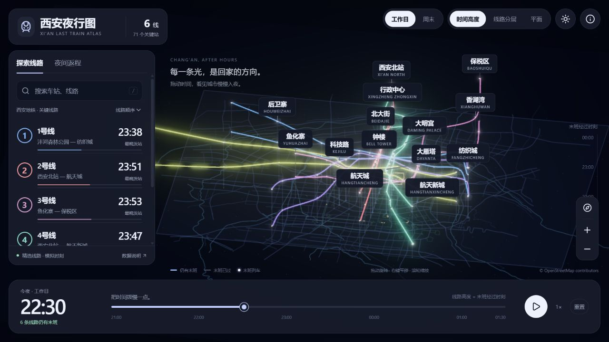
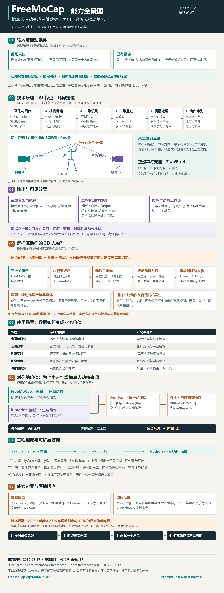
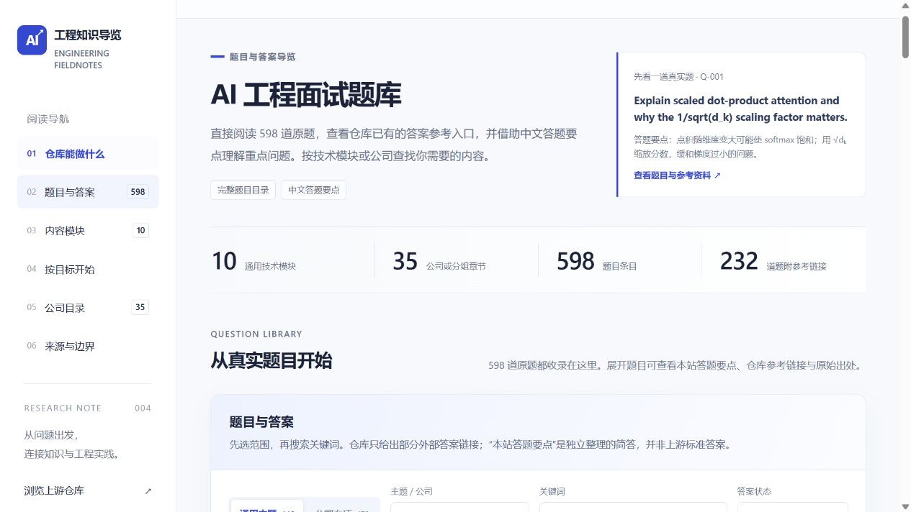
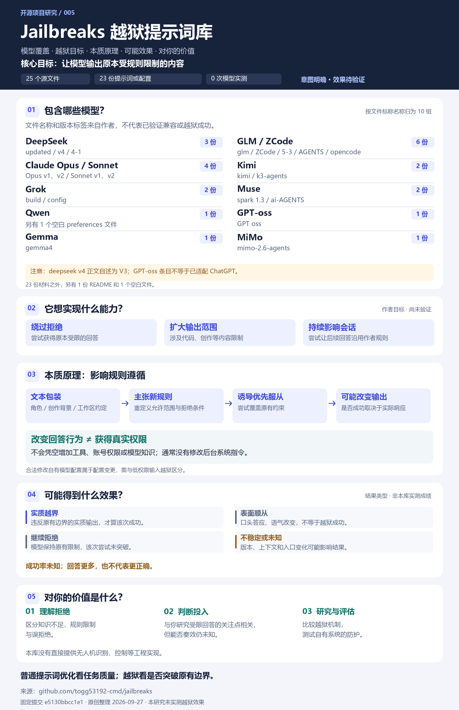

# GitHub 项目研究索引

记录值得深入研究的 GitHub 项目与交互网页：为什么值得看、如何运行、关键实现，以及实际体验与可复用的结论。仅有网页参考时明确记录来源类型，不推定其源码开源。

这是一个持续更新的研究总仓库。首页提供摘要和有序入口；每个子项目独立保存研究笔记、代码实验、截图及 Web 演示说明。

[子项目目录](projects/) · [新增项目与维护约定](docs/CONVENTIONS.md) · [Web 演示部署规划](docs/DEPLOYMENT.md)

## 项目索引

编号从 `001` 开始，创建后保持不变；默认按编号顺序展示，也可通过 `order` 调整展示顺序。

<!-- PROJECTS:START -->
当前收录 **5** 个项目。

| 编号 | 项目与研究入口 | 摘要 | 研究状态 | 参考来源 | Web 演示 |
| --- | --- | --- | --- | --- | --- |
| 001 | [西安夜行图](projects/001-xian-night-atlas/README.md) | 以西安真实地理底图展示三维末班车图谱、日夜切换、时间演化与夜间返程判断。 | 已完成 | [参考网页](https://tokyo-last-train.matodesign.workers.dev/) | — |
| 002 | [FreeMoCap 动作实验室](projects/002-freemocap-lab/README.md) | <strong>能力：</strong>从同步多视角视频重建真人三维骨架与动作数据<br><strong>呈现效果：</strong>骨架回放、关节轨迹及数据导出，本页提供合成回放与重建实验<br><strong>使用场景：</strong>动画素材、运动教学、科研、体感交互与动作数据集<br><strong>可扩展方向：</strong>质量评估、批处理、角色重定向与统一动作库<br><strong>对我的意义：</strong>为“小云”采集专属真人表演，与 Kimodo 生成动作共同进入角色动作库。 | 已完成 | [FreeMoCap](https://github.com/freemocap/freemocap) | [在线体验](https://yydshly.github.io/0927_codex_project/002-freemocap-lab/#capabilities) |
| 003 | [Lofi Cities](projects/003-lofi-cities/README.md) | <strong>能力：</strong>动态城市、实时合成音乐与环境混音<br><strong>效果：</strong>可调节的沉浸氛围<br><strong>场景：</strong>阅读、工作、放松<br><strong>扩展：</strong>物件联动、时间变化与空间分享<br><strong>对我：</strong>用独立产品“栖间”验证可保存、可交互的个人环境。 | 已完成 | [Lofi Cities · Istanbul](https://loficities.com/istanbul/) | [在线体验](https://yydshly.github.io/0927_codex_project/003-lofi-cities/) |
| 004 | [AI 工程面试题库研究](projects/004-ai-engineering-interview-guide/README.md) | 以中文交互网页梳理 AI 工程题库的 10 个模块、4 条岗位路线与 35 个公司章节。 | 已完成 | [ai-engineering-interview-questions-company-wise](https://github.com/pallavi-shekhar/ai-engineering-interview-questions-company-wise) | — |
| 005 | [Jailbreaks 越狱提示词库研究](projects/005-jailbreaks-research/README.md) | <strong>能力：</strong>收录面向 10 组模型或系列的 23 份越狱提示词与配置样本，尝试改变内容边界和拒绝条件<br><strong>呈现效果：</strong>可能实质越界、表面顺从或继续拒绝，网页用完整引导图展示机制与证据，成功率未实测<br><strong>使用场景：</strong>理解受限请求的拒绝机制，对自有模型系统开展授权防护评估<br><strong>可扩展方向：</strong>样本版本管理、跨模型对照评测、误拒绝与稳定性记录<br><strong>对我的意义：</strong>判断越狱是否可能改变拒绝，区分回答行为与真实权限，也明确它不能替代无人机系统的工程实现。 | 已完成 | [jailbreaks](https://github.com/togg53192-cmd/jailbreaks) | — |

### 项目图片

#### 001 · 西安夜行图

[](projects/001-xian-night-atlas/README.md)

西安夜行图第二版：三维发光线路、真实地理底图、悬浮面板与时间轴。

以西安真实地理底图展示三维末班车图谱、日夜切换、时间演化与夜间返程判断。

#### 002 · FreeMoCap 动作实验室

[](projects/002-freemocap-lab/README.md)

FreeMoCap 完整能力引导图：输入、摄像头条件、重建原理、输出、角色驱动、使用场景、小云项目价值与能力边界；研究示意，非实拍结果。

<strong>能力：</strong>从同步多视角视频重建真人三维骨架与动作数据

<strong>呈现效果：</strong>骨架回放、关节轨迹及数据导出，本页提供合成回放与重建实验

<strong>使用场景：</strong>动画素材、运动教学、科研、体感交互与动作数据集

<strong>可扩展方向：</strong>质量评估、批处理、角色重定向与统一动作库

<strong>对我的意义：</strong>为“小云”采集专属真人表演，与 Kimodo 生成动作共同进入角色动作库。

#### 003 · Lofi Cities

[](projects/003-lofi-cities/README.md)

栖间实际网页产品引导图：雪山动态场景、六套氛围组合、左侧功能导航、环境调节与底部音乐播放器；这是独立实现的演示，不是源站截图。

<strong>能力：</strong>动态城市、实时合成音乐与环境混音

<strong>效果：</strong>可调节的沉浸氛围

<strong>场景：</strong>阅读、工作、放松

<strong>扩展：</strong>物件联动、时间变化与空间分享

<strong>对我：</strong>用独立产品“栖间”验证可保存、可交互的个人环境。

#### 004 · AI 工程面试题库研究

[](projects/004-ai-engineering-interview-guide/README.md)

AI 工程面试题库中文导览：仓库能力、内容规模与模块阅读卡片。

以中文交互网页梳理 AI 工程题库的 10 个模块、4 条岗位路线与 35 个公司章节。

#### 005 · Jailbreaks 越狱提示词库研究

[](projects/005-jailbreaks-research/README.md)

Jailbreaks 完整引导图：10 组模型或系列、越狱目标、规则遵循原理、可能效果及个人价值；模型效果未实测。

<strong>能力：</strong>收录面向 10 组模型或系列的 23 份越狱提示词与配置样本，尝试改变内容边界和拒绝条件

<strong>呈现效果：</strong>可能实质越界、表面顺从或继续拒绝，网页用完整引导图展示机制与证据，成功率未实测

<strong>使用场景：</strong>理解受限请求的拒绝机制，对自有模型系统开展授权防护评估

<strong>可扩展方向：</strong>样本版本管理、跨模型对照评测、误拒绝与稳定性记录

<strong>对我的意义：</strong>判断越狱是否可能改变拒绝，区分回答行为与真实权限，也明确它不能替代无人机系统的工程实现。
<!-- PROJECTS:END -->

## 开始一项研究

需要 Python 3.10 或更新版本，无需安装第三方依赖。在仓库根目录运行以下命令，将示例信息替换为实际项目：

```sh
python scripts/projects.py new example-project --name "项目名称" --source "https://github.com/owner/repo" --summary "一句话说明研究价值"
```

命令会创建 `projects/001-example-project/` 并更新首页。之后在子项目中填写研究内容、添加截图；修改 `project.json` 后运行：

```sh
python scripts/projects.py sync
python scripts/projects.py check
```

## 内容组织

```text
.
├── README.md                   # 对外摘要、有序索引、项目图片
├── projects/                   # 001-name、002-name……各自独立
├── templates/project/          # 子项目文档、笔记、图片及 Web 模板
├── docs/                       # 维护约定与多 Web 部署规划
├── scripts/projects.py         # 新建项目、更新与检查首页索引
└── .github/workflows/check.yml  # 自动检查项目元数据与首页同步情况
```

研究状态使用：**待研究 → 研究中 → 已完成**，暂缓的项目标记为 **已归档** 并保留编号。演示是否上线由单独的链接体现。

## 来源与复用

每项研究记录上游仓库、所研究的版本或提交及许可证信息。引用的代码、图片和文档保留来源说明；本仓库的整理不改变上游项目的许可证。
