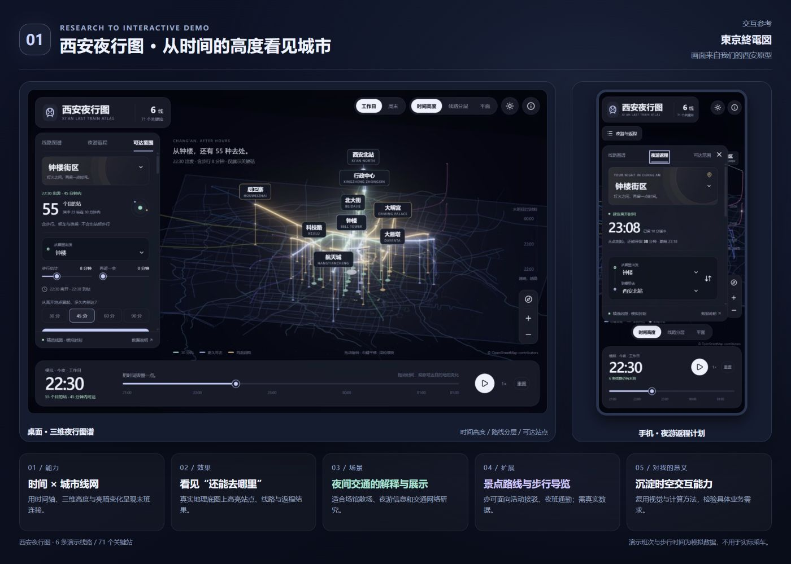
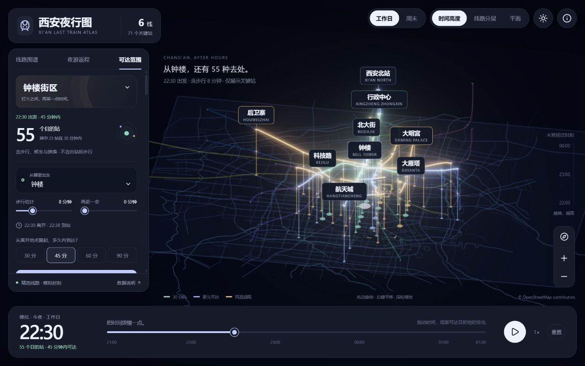
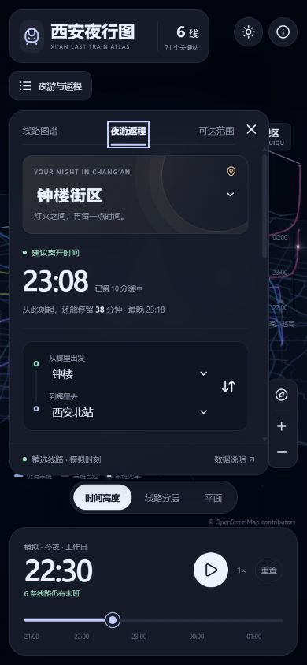

# 001 · 西安夜行图

> 从参考网页“東京終電図”出发，以西安为原型研究“线路地图 × 时间变化 × 夜间返程”的交互表达。来源是一处网页，未确认其对应的公开源码仓库或许可证。

[返回总索引](../../README.md) · [参考网页：東京終電図](https://tokyo-last-train.matodesign.workers.dev/) · [研究记录](notes/research.md) · [演示源码与运行说明](web/README.md)

## 我们理解的价值

| 问题 | 研究结论 |
| --- | --- |
| 能力是什么 | 参考网页用三维线网和时间轴呈现东京末班车网络。我们的独立西安原型增加了夜游返程与限时可达站点的**模拟计算**。 |
| 效果怎样 | 线路高度编码末班经过时刻；拖动时间后已过区段渐暗，站点、可达路径与返程详情联动。引导图全部取自我们的产品截图。 |
| 使用场景 | 适合解释夜间交通网络、演示活动散场与夜游信息。当前仅覆盖西安 6 条演示线路、71 个关键站；没有真实逐车班次，不能用于实际乘车。 |
| 可扩展产品方向 | 景点选中后推荐主题路线、沿路线展示内容与时间，接入真实步行导航；也可延伸到场馆散场接驳、园区夜班交通。导览和运营服务需要真实地点、道路、时刻与合作方数据。 |
| 对我的意义 | 沉淀时间驱动的地图表达、路线计算和交互设计方法，为后续城市漫游导览或交通运营场景提供可复用的实验基础；独立商业价值仍待验证。 |



上图的桌面地图与手机面板都是本项目实际运行画面；原网页只作为设计和交互参考，没有使用其图片或未知授权的源码。

## 可以怎样发展为产品

1. **城市漫游导览**：选择景点，关联策划好的主题步行路线；选择路线后依次展示沿途景点、故事、停留时间和返程余量。实地行走需要真实步行路网、景点入口、定位与路线偏离处理，可接入成熟地图的导航能力。当前原型尚未实现这条步行导览链路。
2. **活动散场服务**：把场馆出口、分批离场、地铁末班和接驳车放在一条时间线上，面向主办方和观众分别展示安排；需要场馆、活动与运力数据。
3. **园区夜班接驳**：结合班次、上车点与车辆，找出赶不上车的员工和运力缺口；适合作为有固定晚班的机构试点。

现有地图软件已经擅长普通路径查询。这里更值得验证的是路线内容、多人离场安排，以及时间变化如何影响下一步决定。

## 第三版：夜游返程与时间可达范围

这一版把地图展示推进到夜游决策：**从哪里出发、还能逛多久、此刻有哪些目的地可选**，共用一条时间轴。所有班次与步行估计仍为演示数据。

- **4 个夜游出发预设**：钟楼街区、永宁门广场、大雁塔北广场、大唐芙蓉园周边；也可自选车站、调整步行分钟数。
- **停留与返程**：可再停留 0–90 分钟，计算计划到站时刻、候车、换乘、到达及最晚离开；建议离开时间比模拟最晚出发提前 10 分钟。
- **30 / 45 / 60 / 90 分钟可达范围**：高亮可达站点和有方向的实际候选区段；起点不计入目的站数量。包含到站步行、候车和换乘，不含停留及出站后的步行。
- **再逛 30 分钟的对比**：列出范围内减少及新增的站点，并可一键试用较晚出发方案。橙色表示届时会超出所选范围，可能是用时超限，也可能已经无法乘车接续。
- **目的地转返程方案**：点击可达站点列表即可生成对应路线；在地图车站详情中也可设置起终点。
- **保存计划**：仅在本浏览器本地保存选择，下次刷新恢复；无需账户，没有上传和后台提醒。

示例：工作日 22:30 从钟楼出发、步行 8 分钟，在 45 分钟行程上限内有 55 个可达目的站；再逛 30 分钟后有 27 个。若去西安北站，当前行程 37 分钟，23:07 到达，建议 23:08 前离开，模拟最晚 23:18 离开。

## 图谱基础能力

- 展示西安 1、2、3、4、5、6 号线的 **71 个关键站点**；点击线路聚焦，点击站点查看不同方向的模拟末班。
- 在 21:00 至次日 01:30 间拖动或播放时间；区间按方向逐渐变灰，光点表示正在经过的模拟末班列车。
- 搜索车站或线路；按线路顺序、最早／最晚结束排序。
- 切换工作日与周末演示运行图；周末统一增加 12 分钟以展示差异。
- 选择起终点及到站步行耗时，计算候车、乘车、每次 6 分钟换乘后的最早到达与最晚离开时间。
- 三个可点击场景：钟楼夜游（直达）、大雁塔散场（换乘）、高新加班（默认时间已错过衔接）。
- 真正的 Three.js 三维场景：时间高度、线路分层、俯视平面三种视角，平滑镜头、拖动旋转、缩放与重置。
- 日间／夜间主题，夜间发光线路与站点，投影标签自动避让；桌面悬浮面板、手机折叠面板。
- 地面叠加 OpenStreetMap 西安道路、河流、公园和城墙快照，71 个演示站点均映射到真实地理位置。

**数据边界：**这不是官方乘车工具，也不是西安完整线网。站名和线路关系参考公开线网，站点使用 OSM 地理位置，空中线路为关键站间平滑连接，部分中间站被省略；班次、区间耗时和步行时间均为模拟数据。页面持续显示数据提示，没有实时运行、定位、票务或全市路线规划能力。

## 运行

环境：Node.js 20+，实测 Node.js 22.15.0。安装依赖后即可运行，无需 API 密钥。Three.js 与 Lucide 使用锁定版本，本地分发；运行时无需第三方网络服务。

```sh
cd projects/001-xian-night-atlas/web
npm ci
npm run dev
```

打开 <http://localhost:4175>。保持启动进程运行即可。若端口被占用，可通过环境变量 `PORT` 指定其他端口。

```sh
npm test
npm run build
```

`web/dist/` 是可独立托管的静态产物。所有资源使用相对路径，可放在 `/0927_codex_project/001-xian-night-atlas/` 这样的子路径下。GitHub Pages 统一发布配置位于仓库的 `docs/site-projects.json`。

## 实际效果



桌面保留全屏三维地图、悬浮面板与时间轴；切换“可达范围”观察此刻的可选目的地。



手机保持地图全屏，线路和返程工具可收起，底部保留时间轴。

## 实现与研究结论

| 内容 | 当前实现 |
| --- | --- |
| 交互参考 | 东京末班车网页的线网、时间轴、方向与详情联动 |
| 技术 | Three.js、OrbitControls、Bloom 后期、原生 JavaScript、Lucide 图标；静态构建 |
| 返程计算 | 以车站、线路、方向作为状态的时刻依赖最早到达搜索 |
| 时间处理 | 保留超过 1440 的服务日分钟数，显示时再转为次日时间 |
| 扩展点 | 数据、计算、界面分离；可替换城市数据，未来接入真实班次 |
| 验证 | 15 项计算、可达范围与保存数据测试；桌面／手机实际操作检查；详见 design-qa.md |
| 参考版本 | 2026-09-27 浏览器访问的公开网页；无上游源码提交 |
| 上游许可证 | 未确认；没有复制其源码、地理资产或时刻数据 |

最值得复用的能力是时间与决策的联动。地图上线路仍然有车，并不表示从当前起点还能经换乘到达目的地；返程计算需要独立验证每段连接。

## 数据与验证的下一阶段

1. 确认西安运营数据的获取与使用方式，补齐完整站点、日期日历、逐车班次和换乘耗时。
2. 保持现有页面作为演示模式；经核验后另行增加真实数据模式及更新日期。
3. 将当前地点预设替换为场馆到真实入口的步行模型，加入演出散场时间和酒店／活动位置比较。
4. 先用一个真实景点路线或一个固定夜班场景验证用户是否会改变行程决定，再评估扩展其他城市或企业接驳。

## 来源

- 交互参考：[東京終電図](https://tokyo-last-train.matodesign.workers.dev/)。用户提供的是网页地址，尚未确认对应 GitHub 仓库，不将其描述为已复用的开源库。
- 线网参考：[西安市交通运输局线网示意图](https://jtj.xa.gov.cn/zmhd/xxcx/dtxl/2005485975194095618.html)。作为城市和线路结构研究入口，未复制图片。
- 截图是本子项目的本地运行画面；源码为本仓库独立实现。


- 地理数据：[OpenStreetMap contributors / ODbL 1.0](https://www.openstreetmap.org/copyright)，2026-09-27 快照，保存在 `web/src/geography.json`；包含 3,879 条道路、85 条河流要素、274 个公园轮廓、71 段城墙和 298 个铁路／地铁站点记录。
- 站名更新：[西安市关于地铁站更名的公告](https://xetdz.xa.gov.cn/xwzx/jkdt/1949648418513137665.html)，使用“八里村”代替旧称“纬一街”。
- 视觉与交互验收：[design-qa.md](design-qa.md)。
