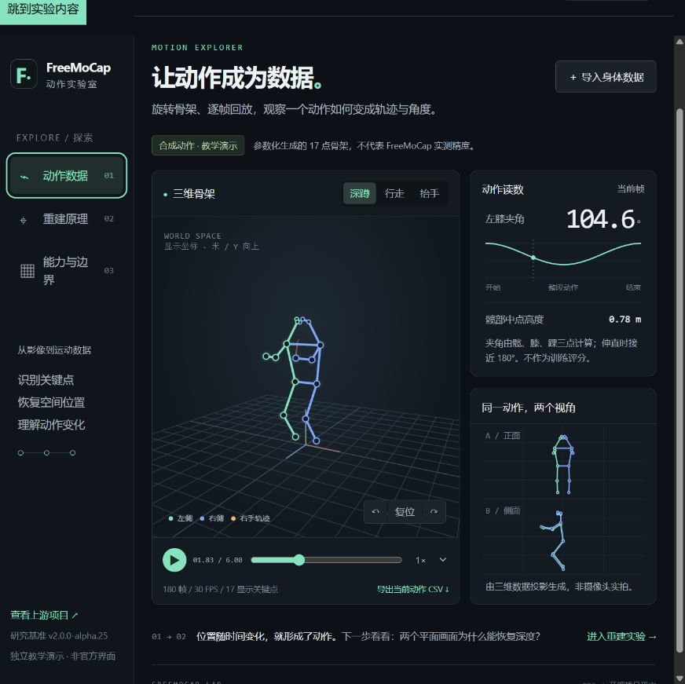

# 002 · FreeMoCap 动作实验室

**能力：** 从同步多视角视频出发，结合相机标定、AI 姿态识别和几何重建，获取真人三维骨架与动作数据。

**呈现效果：** 可回放的三维骨架、关节运动轨迹及可导出的坐标数据；本页提供合成动作回放、NPY 导入、角度曲线、双目重建实验和完整能力引导图。

**使用场景：** 动画与游戏素材、运动教学、科研实验、体感交互、动作数据集。评价动作或驱动具体人物，还需要领域规则或骨架适配。

**可扩展方向：** 数据质量评估、录像批处理、姿态模型替换、固定角色重定向、统一动作库与专项动作指标。

**对我的意义：** 为桌面女友“小云”录制有个人动作习惯的专属表演，与 Kimodo 生成的动作共同进入角色动作库，由对话与事件系统选择播放。

[在线体验：理解与应用](https://yydshly.github.io/0927_codex_project/002-freemocap-lab/#capabilities) · [返回总索引](../../README.md) · [参考来源：FreeMoCap](https://github.com/freemocap/freemocap) · [研究笔记](notes/research.md) · [运行说明](web/README.md)

## 一张图理解 FreeMoCap

[打开能力全景图](assets/freemocap-capability-map.png) · [可编辑矢量版](assets/freemocap-capability-map.svg) · [查看文字说明与一手来源](notes/capability-map.md)

全景图覆盖输入与设备条件、三维重建原理、输出效果、角色驱动链路、使用场景、对“小云”的价值、工程扩展与能力边界。图片为研究整理的原理示意，不是官方海报或实拍结果。

## 已完成的展示

本子项目是独立的中文能力展示和原理教学页面，不是 FreeMoCap 官方界面，也不在浏览器中运行 FreeMoCap 或姿态推理模型。

| 页面 | 实际可操作的内容 |
| --- | --- |
| 动作数据 | 深蹲、行走、抬手；三维旋转；暂停、逐帧和调速；膝角曲线、髋部中点高度、双视角投影、CSV 导出 |
| 重建原理 | 调整机位间距、目标距离、像素偏移、拍摄时间差；关闭第二摄像头；观察射线、重建点及深度误差 |
| 理解与应用 | 本质、摄像头条件、重建原理、输入输出、角色驱动、Kimodo 对照、小云应用、场景、扩展与边界；支持章节跳转和全景图缩放下载 |
| NPY 导入 | MediaPipe 身体 33 点、RTMPose/COCO 17 或 133 点；另附可直接载入的合成格式样例 |

所有内置运动都是参数化合成数据，用于解释数据结构与几何关系，不代表实拍效果或测量精度。页面明确显示数据来源。

## 研究基准

| 项目 | 内容 |
| --- | --- |
| 上游版本 | v2.0.0-alpha.25；发布页对应提交前缀 0b39db9 |
| 核查日期 | 2026-09-26 |
| 上游许可证 | AGPL-3.0；未复制、嵌入上游代码或模型权重 |
| 演示技术 | 原生 JavaScript ES modules、Canvas、HTML/CSS、Node.js 标准库 |
| 外部依赖 | 无 CDN、无 API、无需模型下载或第三方安装 |
| 已测范围 | 自有教学计算、格式解析、页面交互、移动布局 |
| 未测范围 | 实际摄像头采集、上游安装、推理性能、真实测量精度 |

## 运行与构建

需要 Node.js 18+，本次使用 22.15.0。从仓库根目录执行：

    cd projects/002-freemocap-lab/web
    npm run dev

打开 [本地演示](http://127.0.0.1:4178/)。服务仅监听本机。不支持直接以 file:// 打开 ES modules 页面。

    npm test
    npm run build

静态产物在 web/dist/，使用相对资源路径，适配仓库既定的 GitHub Pages 子路径。已于 2026-09-27 上线，纳入仓库统一站点，与 Lofi Cities 一起发布。公网摘要、完整长图缩放、演示切换与合成 NPY 解析回放已验证；[部署记录](https://github.com/yydshly/0927_codex_project/actions/runs/36295964557)。

## 建议体验顺序

1. 暂停深蹲，拖动到第 60 帧：左膝夹角约 95.8°。旋转骨架，比较正面和侧面投影。
2. 打开“重建原理”：默认 f=700 px、B=1.2 m、Z=3 m，视差 280 px，理想误差为零。
3. 定位偏移设为 ±4 px、间距设为 0.3 m：误差约 307.7 mm；将间距增至 2 m，误差约 50.6 mm。
4. 关闭摄像头 B，观察“无法确定深度”。
5. 在“导入身体数据”中载入合成 NPY 格式样例，运行二进制解析、坐标转换与回放。
6. 阅读“理解与应用”，比较 Kimodo 与 FreeMoCap，通过来源链接对应到上游实现。

## 效果截图

截图来自本地演示，显示合成数据，不是 FreeMoCap 实拍捕捉结果。

## 需要理解的边界

- 此页面使用平行双目解析公式 Z=fB/d；上游采用一般多视角的 DLT/SVD 与异常观测处理。
- 固定像素偏移不是随机误差分布。时间差实验假定目标以 0.8 m/s 横向移动；误差可能互相抵消。
- 导入数据会选取 17 个身体点、转换单位与朝上方向，并调整显示原点，不修改原文件。
- CSV 导出为显示坐标，不是原始世界坐标或完整角色旋转动画。
- 髋部中点不是人体质心；三点夹角不是专项训练评分。
- 研究基准版本发布说明列出约 10% 尺度偏差；它不是项目的统一精度指标。

## 实现入口

| 文件 | 职责 |
| --- | --- |
| web/src/math.mjs | 投影、夹角、理想双目重建 |
| web/src/data.mjs | 合成骨架、NPY 解析、骨架映射、坐标转换、CSV |
| web/src/render.mjs | 透视骨架、二维视图、曲线与射线图 |
| web/src/app.mjs | 交互、时间轴、导入与导出 |
| web/tests/core.test.mjs | 23 项几何与文件解析检查 |
| experiments/generate-sample.mjs | 重新生成合成 NPY 样例 |
