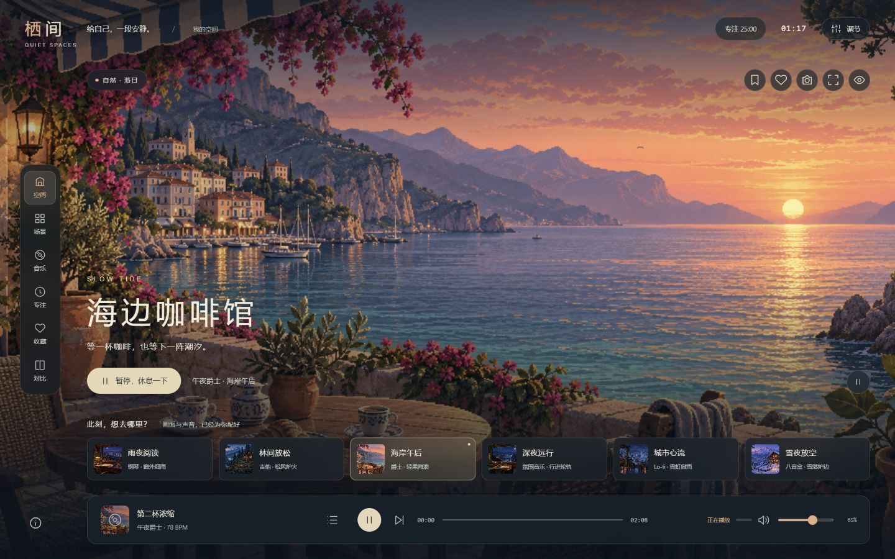
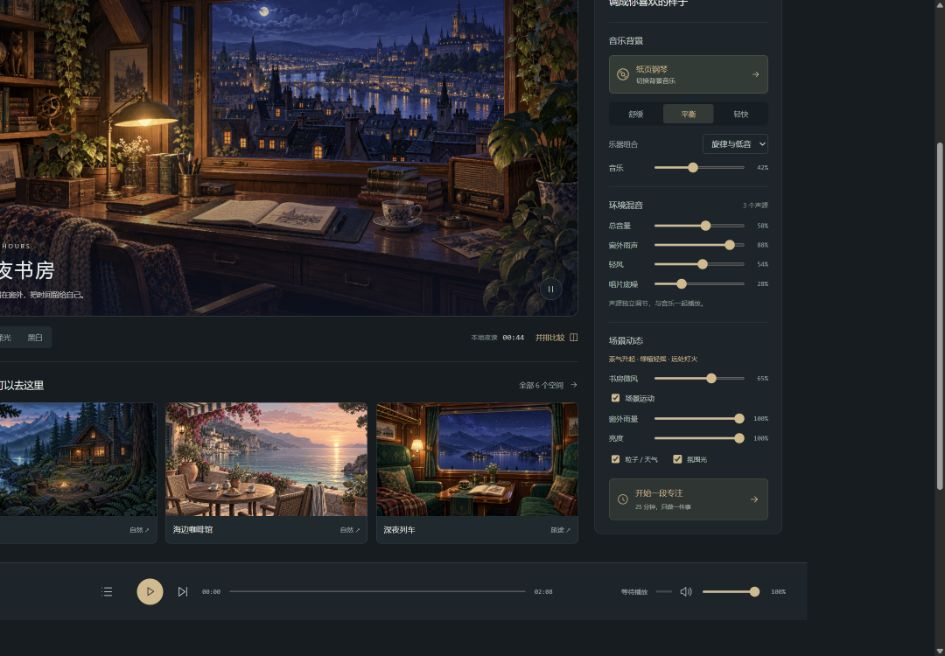
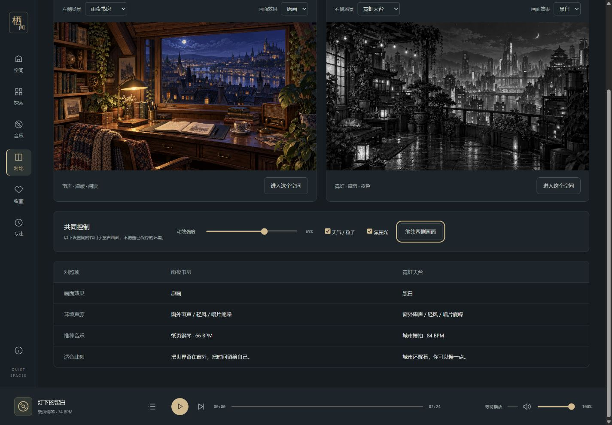
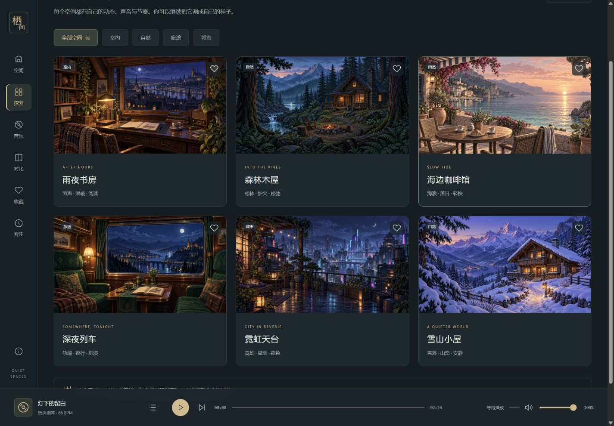
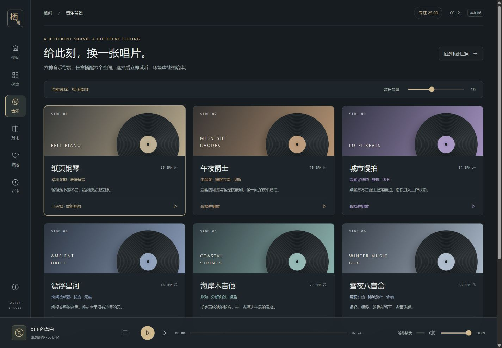

# 003 · Lofi Cities

> 源网页：[Lofi Cities · Istanbul](https://loficities.com/istanbul/)。研究它如何把动态画面、实时合成音乐与环境混音组织成个人氛围空间，并以独立产品“栖间”验证这些思路。

[在线体验](https://yydshly.github.io/0927_codex_project/003-lofi-cities/#space) · [产品理解与引导](https://yydshly.github.io/0927_codex_project/003-lofi-cities/#understanding) · [源网页 Lofi Cities](https://loficities.com/istanbul/) · [返回总索引](../../README.md) · [产品说明](notes/product.md) · [新增产品理解](notes/product-understanding.md) · [研究记录](notes/research.md) · [场景原理](notes/scene-lab.md) · [原站能力走查](notes/web-audit.md) · [产品方向](notes/product-directions.md) · [运行说明](web/README.md)

## 五个问题读懂这项研究

| 问题 | 我们的理解 |
| --- | --- |
| 能力是什么？ | 原站通过程序城市动画、Web Audio 实时合成音乐、独立环境声、节奏/配器调节和专注/睡眠计时，组织持续的视听环境。确认的是完整网页产品，尚未确认可直接安装的开源库或许可证。 |
| 呈现效果是什么？ | 原站是具有地域辨识度的像素城市夜景。我们的“栖间”采用六幅独立生成的插画，加上水面、火焰、蒸汽、天气、列车窗外等局部动态，以及六种合成音乐和环境混音；实际运行效果见下方截图。 |
| 使用场景是什么？ | 阅读、独立工作、休息、背景陪伴；用户主动选择意图，再调节亮度、动态与声音。配置保存后可恢复，无需每次重新搭配。 |
| 可扩展方向是什么？ | 先提升视听品质和自然循环，再做窗户/台灯等物件交互；随后加入时间天气变化、专注阶段联动、个人空间编辑分享；更远期验证桌面小窗、直播输出和网页嵌入。 |
| 对我的意义是什么？ | 提供一个可以亲自操作、比较与验证的产品样本：从画面和音乐组合，推进到可保存、可交互的个人环境。帮助判断自己更适合做个人工具、场景内容产品或可嵌入其他网页的氛围组件，并用日常使用反馈验证价值。 |

核心关系是 **个人意图 → 视听环境 → 交互反馈 → 持续匹配**。当前匹配来自主动选择与保存；自动情绪识别、点击物件联动与个性化推荐尚未实现。

## 实际网页产品引导图

[](https://yydshly.github.io/0927_codex_project/003-lofi-cities/#space)

这张图来自栖间实际运行的桌面网页，没有额外绘制模拟界面；它不是 Lofi Cities 源站截图。图片呈现布局，动画与声音需打开在线体验。

1. **选择组合**：画面下方选择雨夜阅读、林间放松等完整组合，点击后开始声音。
2. **调整环境**：右上角“调节”控制天气、动态、明暗、音乐及环境声；底部控制播放与总音量。
3. **比较与保存**：左侧“对比”比较场景，用“收藏”保存自己调好的整套环境。
4. **持续使用**：按需进入“专注”或沉浸模式，下次恢复个人配置；“理解”栏目连接产品原理、使用示例与扩展路线。

## 现在可以体验什么

**栖间**以全窗口动态场景为主界面，将场景、音乐、环境调节、专注、收藏和对比组织在同一体验中。

- 六套可直接播放的完整组合：雨夜阅读、林间放松、海岸午后、深夜远行、城市心流、雪夜放空；一键切换画面、音乐、天气和环境混音。

- 六幅精细场景原画，加入水面、火焰、蒸汽、植物等独立动画，列车采用前景与窗外分层：雨夜书房、森林木屋、海边咖啡馆、深夜列车、霓虹天台、雪山小屋。
- 六种可选音乐：钢琴、爵士电钢琴、Lo-fi、氛围合成器、木吉他和八音盒；每种 4 段轮播编曲。支持本地 MP3 / WAV / OGG，独立环境混音、音乐速度与配器控制。
- 原画、柔光、黑白效果；场景运动速度与天气强度分别控制，支持独立开关和统一暂停。探索和收藏卡片可播放动态预览。
- 两侧场景比较，共同调节画面后将任意一侧设为当前空间。
- 收藏场景、保存和恢复完整环境，分别记住每个场景的设置。
- 专注/休息、自定周期、完成记录，睡眠定时与最后 30 秒渐弱。
- 沉浸、全屏和 1920×1080 PNG 导出。

声音默认关闭，点击“开启这一刻”、底部播放按钮或任一氛围组合开启。无须安装依赖或登录；数据保存在当前浏览器。当前是本地单人版本，没有云同步、多人房间或离线安装。

## 运行

在仓库根目录运行：

```sh
python -m http.server 4313 --bind 127.0.0.1 --directory projects/003-lofi-cities/web
```

访问 [栖间](http://127.0.0.1:4313/#space)、[六场景探索](http://127.0.0.1:4313/#explore) 、[选择音乐](http://127.0.0.1:4313/#music) 或 [并排对比](http://127.0.0.1:4313/#compare)。面向桌面使用，未进行移动端专项测试。

```sh
node --test projects/003-lofi-cities/web/tests/preset.test.js projects/003-lofi-cities/web/tests/lab.test.js projects/003-lofi-cities/web/tests/product.test.js projects/003-lofi-cities/web/tests/motion.test.js projects/003-lofi-cities/web/tests/moments.test.js
python projects/003-lofi-cities/web/build.py --package
python scripts/projects.py check
```

构建输出为 `dist/003-lofi-cities/`，另生成独立成品包 `dist/quiet-spaces-3.1.0.zip`，支持子路径部署。成品包包含入口、代码、素材与使用说明。已通过 GitHub Pages 公开部署，支持 [在线体验](https://yydshly.github.io/0927_codex_project/003-lofi-cities/#space)。

## 动态效果

[列车 8 秒动态预览](assets/train-motion-v4.webm)：固定车厢与连续移动的窗外全景。

[v4 动态图层素材与提示词](notes/artwork-v4.md)

## 产品截图











场景原画使用内置 ImageGen 制作，见 [素材与完整提示词](notes/artwork-v3.md)。运行时只加载本地图片；音乐为浏览器实时合成，也可播放自己的录音文件。

## 研究档案

原来的展示、证据和单场景教学实验保留在 [研究档案](https://yydshly.github.io/0927_codex_project/003-lofi-cities/research.html#overview) 与 [雨夜书房原理实验](https://yydshly.github.io/0927_codex_project/003-lofi-cities/research.html#lab)。

参考对象为 [Lofi Cities](https://loficities.com/istanbul/)，作者 [Safa Elmali](https://github.com/SafaElmali)。已阅读线上公开脚本，确认 Canvas 绘制与 Web Audio 合成主要路径；未确认对应开源仓库或许可证。栖间的程序独立编写，场景原画独立生成，没有接入或分发原站应用引擎。引用截图仍在研究页标明来源，详见 [图片与来源](assets/README.md)。

## 新增产品理解

[网页中的产品理解](https://yydshly.github.io/0927_codex_project/003-lofi-cities/#understanding)：个人意图、视听环境、交互反馈、持续匹配；可切换阅读、工作与放松示例，并区分当前能力、下一步联动与长期推荐。原研究页也已接入该入口。
## 远端发布验证

2026-09-27 已发布到 GitHub Pages。源网页链接、站点索引、默认场景、组合播放/暂停、产品理解示例和实际截图引导均已从远端检查；场景图片加载正常，播放控制切换正常，组合操作不会自动启动专注计时。浏览器未发现脚本错误。

27 项产品测试、5 项索引与站点检查通过，远端检查和部署工作流成功。后续对本项目的相关修改推送到 `main` 后会自动更新。GitHub Pages 保存静态网页，个人设置仍在各自浏览器中，不会在本地地址和远端地址之间自动同步。
