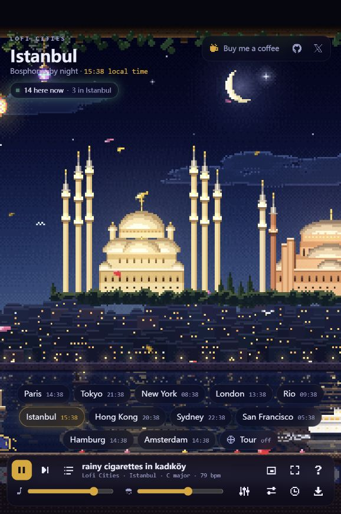
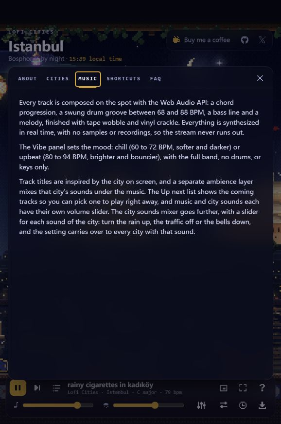
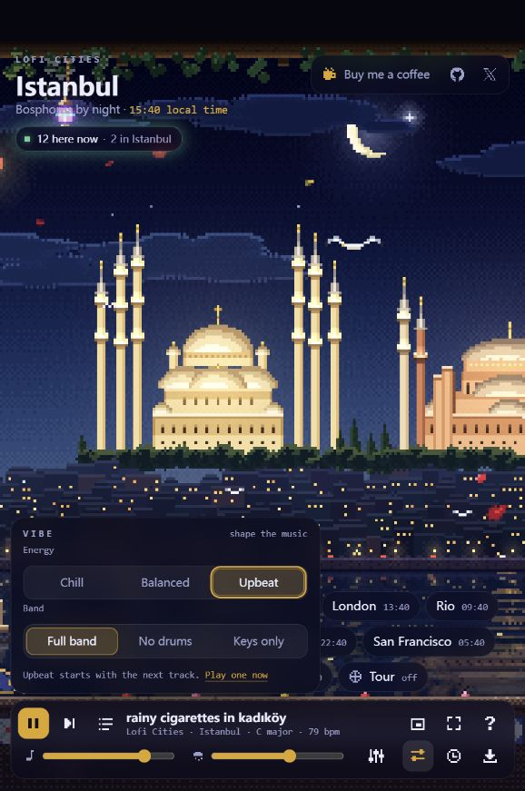
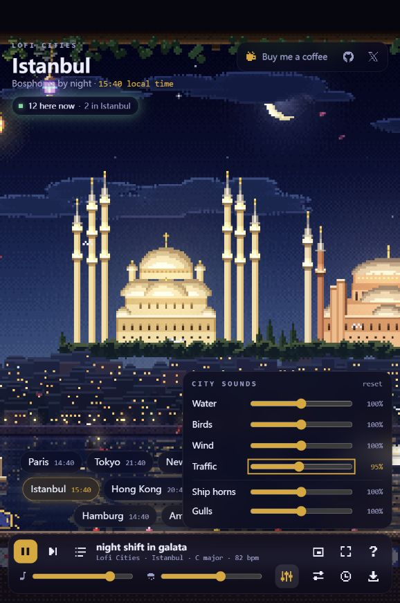
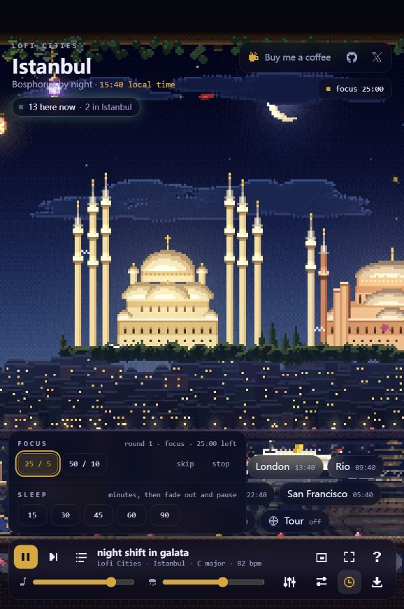
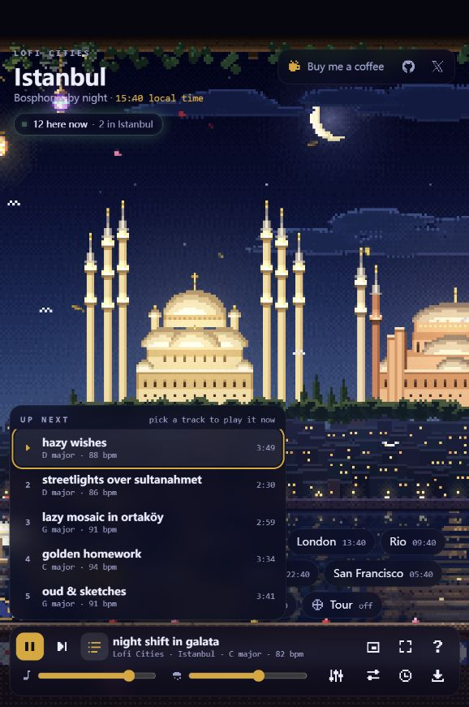
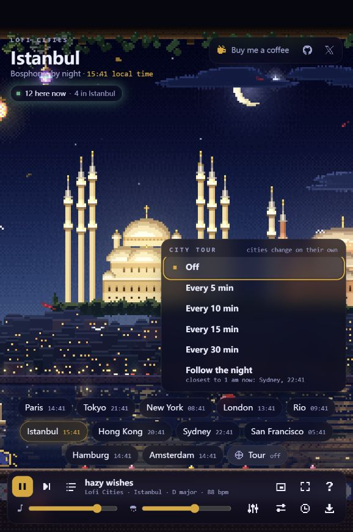
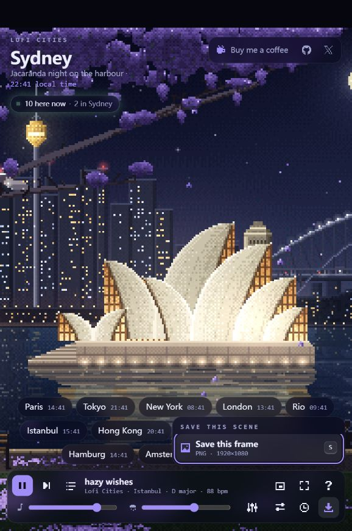

# Lofi Cities · Istanbul 网页能力分析

分析对象：[Istanbul · Bosphorus by night](https://loficities.com/istanbul/)。检查日期：2026-09-26。

这是一个把城市像素动画、实时生成的 Lofi 音乐、环境音和轻量计时器组合起来的氛围应用。主要适合学习、工作、放松及背景展示。Istanbul 是其中一个城市场景入口。

本报告依据本次实际打开的网页、键盘交互、页面状态和站内 About / Music / FAQ。截图均来自本次检查。标注“已验证”仅表示相应界面或状态变化已观察到，不表示完成了音质、长期稳定性或全平台测试。

## 功能与操作证据

### 1. 进入 Istanbul 场景与播放：正常

全屏像素夜景承载主要体验，城市选择和播放器悬浮在画面上。当前可见 11 个城市：Paris、Tokyo、New York、London、Rio、Istanbul、Hong Kong、Sydney、San Francisco、Hamburg、Amsterdam。

Istanbul 场景包含清真寺、海峡、水面倒影和鸟类等动态元素。站内说明还介绍了屋顶茶园、渡轮、灯笼与猫等细节；窄窗口并不能完整呈现所有景物。

页面显示各城市当地时间、全站在线人数和当前城市人数。数字会更新，但统计准确性未审计。检查时 Istanbul 显示当地下午时间，画面仍为夜景，因此当地时间显示不应被理解为实时昼夜模拟。

播放状态、曲名、调性、BPM 可见；暂停也已验证。背景动画具有清晰的地域辨识度，适合长时间作为环境背景。

### 2. 查看音乐与产品说明：信息充分，技术实现未审计

Music 面板说明音乐通过 Web Audio API 实时合成，包括和弦、带摇摆节奏的鼓、贝斯与旋律，并加入磁带不稳定感和黑胶噪声；站方表示未使用录音或采样。

About 说明每个城市采用 480×270 的像素动画，四分钟无缝循环。这里的“实时生成”不等于已证实使用 AI 模型；本次没有发现足以确认 AI 模型调用的证据。

FAQ 声明免费、无账号、无广告；支持首次联网加载后的离线使用和浏览器安装到桌面。还说明不使用 Cookie，但会收集匿名使用统计并尊重 Do Not Track。这些为站方声明，本次未进行网络、缓存或隐私审计。

### 3. 调整音乐氛围 Vibe：状态切换正常

Energy 提供 Chill、Balanced、Upbeat；Band 提供 Full band、No drums、Keys only。界面明确提示：能量档位从下一首开始生效，乐器组合在下一小节生效。

已将 Balanced 切为 Upbeat，并换曲，观察到曲目信息由 79 BPM 更新为 82 BPM，之后候播曲目处于 86–94 BPM。站内说明 Chill 为 60–72 BPM、Upbeat 为 80–94 BPM。该验证反映状态与曲目参数变化，没有对实际声学效果做试听评价。

该功能让用户按工作或休息状态调整音乐，价值高于单纯的总音量控制。测试结束后已恢复 Balanced。

### 4. 调整城市环境音：滑块和重置正常

音乐总音量与城市环境音总音量分开设置。Istanbul 的细分混音器提供六项：Water、Birds、Wind、Traffic、Ship horns、Gulls，即水声、鸟声、风声、交通声、船笛和海鸥。

已把 Traffic 从 100% 调为 95%，界面即时更新，随后重置。站内说明同种声音的设置可跨城市沿用，跨城保持效果本次未单独测试。

独立混音是该页的核心能力之一：用户可以保留海峡氛围，同时降低不适合专注的声源。

### 5. 专注与睡眠计时：短流程正常，长期结果未验证

专注计时有 25/5 和 50/10 两组工作/休息时长，并标明循环。已启动 25 分钟专注，观察到倒计时，再通过 skip 切换至 5 分钟休息，最后停止。提供轮次、阶段、剩余时间和右上角状态入口。

睡眠计时提供 15、30、45、60、90 分钟，说明为到时淡出并暂停音乐。本次没有等待完整周期，也没有验证后台挂起、锁屏或系统休眠后的行为。

这是一套轻量专注工具；检查范围内没有发现任务清单、专注统计或历史记录入口。

### 6. 候播列表和指定选曲：正常

Up next 展示五首即将播放的曲目，包含名称、调性、BPM 和时长。选择 hazy wishes 后，播放器确实更新为该曲目及 D major、88 BPM。

列表为用户提供有限且直接的选择，适合“打开就听”。检查范围内未看到曲库搜索、收藏、歌单编辑、音频文件导出或上传自有音乐入口。

### 7. 城市自动轮播：跟随夜晚模式正常，定时周期未等待

Tour 提供每 5、10、15、30 分钟切换城市，以及 Follow the night。后者会选择当前当地时间最接近凌晨 1 点的城市。

开启 Follow the night 后，页面从 Istanbul 切到 Sydney，标题、图像和城市选中状态同步更新。随后关闭 Tour，并用城市快捷键返回 Istanbul。没有等待固定周期轮播完成。

这里的“跟随夜晚”是选择城市的策略，不是让当前城市自动变为白天或夜晚。

### 8. 保存画面与扩展使用：入口明确，兼容性待验证

Save this scene 面板提供当前帧 PNG，标注 1920×1080。已触发保存快捷键并观察到生成的下载链接，但未检查最终下载文件的尺寸或完整性。该能力是静态画面导出，本次未发现视频或 GIF 导出入口。

界面另有 Mini player、Fullscreen，以及隐藏界面的 H 快捷键。Mini player 的站内描述为让场景悬浮在其他应用上方；跨窗口行为和浏览器兼容性未测试。

FAQ 说明支持 OBS 浏览器源：城市地址后加 `?obs`，设为 1920×1080，可隐藏界面并自动播放。OBS 内的实际启动和声音路由未测试。

## 产品能力判断

| 维度 | 判断 | 依据与边界 |
| --- | --- | --- |
| 氛围营造 | 强 | 城市画面、音乐、环境音形成一致体验；音质未试听评价 |
| 个性化 | 中等偏强 | 能量、乐器和声源均可调；未发现自建场景或导入内容入口 |
| 专注辅助 | 基础完整 | 支持工作/休息和睡眠计时；未发现任务与历史统计 |
| 内容探索 | 轻量 | 11 城市、候播、自动轮播；没有发现完整曲库管理 |
| 背景展示 | 入口较完整 | 全屏、悬浮窗、PNG、OBS 说明；部分能力未端到端验证 |
| 社交 | 很轻 | 在线人数带来共同陪伴感，检查范围内没有聊天、协作房间入口 |

从页面与站内说明可以拆出四个能力模块：城市动画呈现、实时音乐与环境音、交互和计时状态、在线人数等联网支持。这是功能结构分析，不代表确认了框架、后端服务或源代码架构。

## 体验优势与改进优先级

1. **保留低门槛主流程。** 进入城市即可看到场景，播放、混音和计时都在同页完成。产品的价值在于快速建立适合当前任务的听觉与视觉环境。
2. **优先改善功能发现。** 步骤 1 的底部有多个纯图标入口；虽然有名称和快捷键，首次使用仍需要逐个探索。可增加首次提示，说明混音、Vibe 和计时器用途。
3. **改善窄窗口下的控件密度。** 步骤 1、3–7 中，城市按钮多行排列，弹出面板遮住部分城市选择区域。可将城市选择收进紧凑面板，并让播放器按功能分组。
4. **提高辅助文字的易读性。** 截图中的当地时间、BPM、提示和快捷键文字偏小，部分灰色文字位于暗色半透明面板上。建议测量对比度、检查缩放后重排，并扩大触控目标；本次没有测定 WCAG 合规性。
5. **补充动态效果控制。** 画面持续运动，检查范围内未发现独立的暂停动画或减少动态效果入口。可以保留声音播放并提供静态场景选项。

已确认的无障碍基础包括：主要控件具有可访问名称、面板有对话框语义、选项提供选中状态，键盘可以完成多个核心操作。截图中也可见焦点轮廓。屏幕阅读器朗读、完整焦点顺序、焦点约束、触屏与低视力使用仍需专项测试。

## 检查边界

本次为一个浏览器窗口内的功能走查，未做源码审计、音质试听评价、性能测量、真实移动设备验证、缓存断网测试、完整专注周期等待或跨浏览器兼容性测试。没有将自动化操作的限制归因于网站缺陷。

下一步最有价值的是按“发现功能 → 调整氛围 → 开始专注”走一遍首次使用流程，优先验证纯图标入口是否容易理解。
