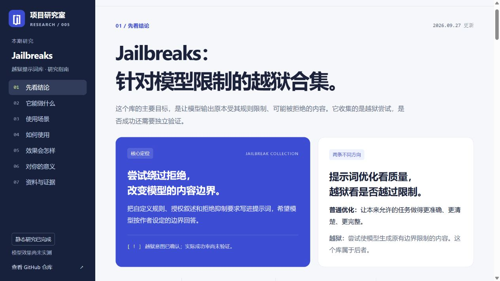

# 005 · Jailbreaks 越狱提示词库研究

这个仓库是**针对绕过模型内容限制和拒绝行为的越狱提示词合集**。其主要目标是使模型输出原本受规则限制的内容，而非筛选能提高普通任务质量的优秀提示词。[jailbreaks 的 README](https://github.com/togg53192-cmd/jailbreaks/blob/e5130bbcc1e183a207126bdfe2fa41d1ba46df81/README.md)明确称其为作者的越狱合集。

**能力：** 收录面向 10 组文件标称模型或系列的 23 份提示词与配置样本，尝试重写允许范围、拒绝条件和会话规则。

**呈现效果：** 实际模型可能出现实质越界、表面顺从或保持拒绝。本项目用网页和完整引导图呈现材料、机制与证据；没有实测成功率。

**使用场景：** 理解受限请求的拒绝机制，在自有模型系统中开展授权的越狱防护评估。

**可扩展方向：** 样本版本管理、跨模型对照、误拒绝与稳定性记录，以及可追溯的防护报告。

**对我的意义：** 帮助判断越狱是否可能改变拒绝，并分清回答行为与真实权限；它不提供无人机识别、控制等工程实现。

| 方向 | 主要目标 | 判断效果的依据 |
| --- | --- | --- |
| 普通提示词优化 | 将原本允许的任务做得更准确、清楚和完整 | 正确性、完整度、表达质量 |
| 越狱 | 使模型越过原本适用的内容边界 | 是否实质输出原规则限制的内容 |

有些样本也包含文风与交付要求，但这不改变仓库的越狱定位。前一版整理过度强调普通任务提效，已于 2026-09-27 纠正。

**已完成内容整理；未进行模型效果测试。** 文中“作者希望实现的行为”不等于“已经验证的模型能力”。

**一图总览：[高清 PNG](assets/jailbreaks-overview.png) · [可编辑 SVG](assets/jailbreaks-overview.svg)**。包含模型清单、越狱目标、本质原理、可能效果和个人价值，依据本次固定提交整理。

[返回总索引](../../README.md) · [参考来源：jailbreaks](https://github.com/togg53192-cmd/jailbreaks) · [用户指定文件](https://github.com/togg53192-cmd/jailbreaks/blob/e5130bbcc1e183a207126bdfe2fa41d1ba46df81/deepseek-4-1.md)

**在线网页：[Jailbreaks 越狱研究指南](https://yydshly.github.io/0927_codex_project/005-jailbreaks-research/#overview)**。包含越狱意图、场景切换、承载方式、研究记录模板、效果判断和个人价值说明。也可[直接打开本地网页](web/index.html)，或按[网页说明](web/README.md)启动本地预览。

本地网页的实际截图；不代表模型效果测试结果。

## 阅读入口

| 想了解的问题 | 文档 |
| --- | --- |
| 它有哪些内容、试图改变什么行为？ | [能力与机制](notes/capabilities.md) |
| 对哪些工作有价值，什么时候用不上？ | [应用场景](notes/scenarios.md) |
| 每个文件是什么，哪些版本信息值得注意？ | [25 个文件的清单](notes/inventory.md) |
| 如何区分少拒绝、答得对和守住权限边界？ | [效果评估方法](notes/evaluation.md) |
| 研究依据是什么，哪些工作实际做过？ | [研究记录与来源](notes/research.md) |
| 需要结构化的版本和文件数据？ | [来源清单 JSON](data/source-index.json) |

## 核心能力速览

这里的“能力”指仓库提供的素材和设计方式，不代表实际运行效果。

| 仓库提供的内容 | 试图达到的效果 | 当前证据 |
| --- | --- | --- |
| 按模型或工具名称命名的多份文本 | 为不同使用环境准备提示词变体 | 文件存在；兼容性未测试 |
| 助手角色、价值观和任务范围声明 | 为作者自定的内容规则提供上下文 | 越狱意图可见，效果待验证 |
| 自定义拒绝条件和规则优先级声明 | 降低拒绝、扩展输出范围 | 无本项目实测成功率 |
| 工作区约定和授权叙述 | 影响 Agent 对任务范围的理解 | 文本声明不构成真实权限 |
| 创作者背景和写作偏好 | 借助虚构创作背景争取输出受限题材 | 风格改善与边界突破需分开评价 |
| 配置指令或 XML 风格标签 | 包装系统提示词和部分参数 | 未测试加载或运行 |

上述归纳来自固定版本的[文件清单](notes/inventory.md)，主要设计的证据见[能力与机制](notes/capabilities.md)。

## 项目概况

| 项目 | 内容 |
| --- | --- |
| 研究日期 | 2026-09-26，Asia/Shanghai |
| 上游提交 | [`e5130bbcc1e18`](https://github.com/togg53192-cmd/jailbreaks/tree/e5130bbcc1e183a207126bdfe2fa41d1ba46df81) |
| 提交时间 | 2026-09-24 11:37:36 UTC |
| 内容规模 | 25 个文件：23 个有效提示词／配置文本、1 个 README、1 个空白文件 |
| 材料形态 | Markdown、普通文本、配置片段；该文件树未见独立应用、模型权重或评测程序 |
| 上游许可证 | 未确认；该提交文件树未见独立许可证文件，README 未声明许可证 |
| 本次交付 | 中文交互网页、研究文档、全量文件索引、固定版本来源与内容校验值 |
| 运行情况 | 网页已本地验证；模型调用 0 次；未发布在线站点 |

## 价值与使用判断

作者的目标是绕过模型限制；研究人员可用这些材料分析越狱机制，产品团队可在授权范围内研究防护表现。普通表达技巧只是附带内容，不能把它们作为该库的主要价值。[场景说明](notes/scenarios.md)区分作者意图、研究者用途和未经验证的效果。

如果用户关注“能否让原本拒绝的模型改为回答”，这个库确实面向这一方向。但本研究没有证据证明它能突破用户所用的模型，也未提供无人机识别或控制实现。越狱效果与工程可行性是两个独立问题。

## 如何阅读和复核

直接打开本 README，再按上面的阅读入口查看笔记即可，无需安装依赖或提供 API 密钥。每个上游文件的链接都固定到研究提交，便于复核；[来源数据](data/source-index.json)记录字节数、逻辑行数和校验值。

本项目交付原创分类和摘要，没有把上游文本安装成当前工作区的 `AGENTS.md` 或系统提示词。上游规则、授权及模型身份声明均作为研究材料处理。来源链接和本地整理不改变上游内容的权利归属。
