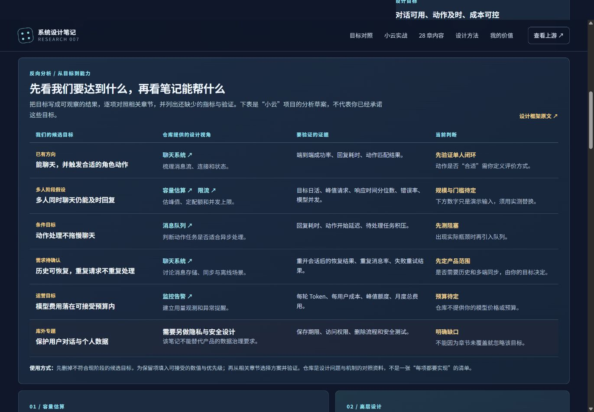
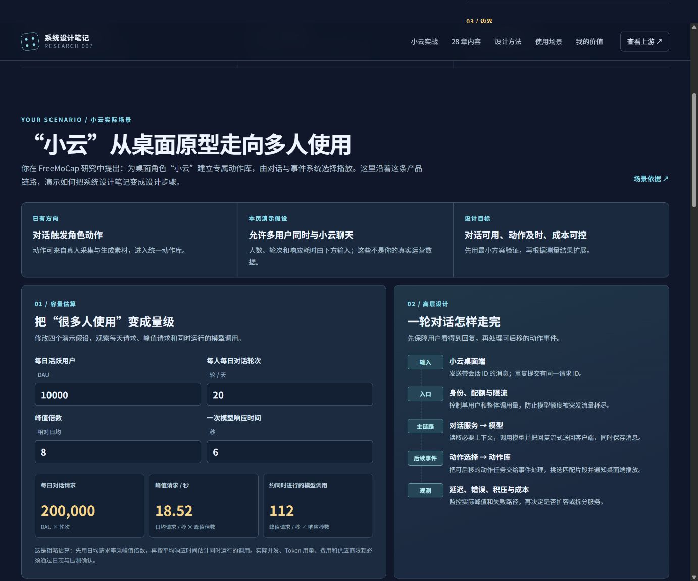

# 007 · 系统设计笔记能力研究

> 一套围绕大型系统设计题的英文学习笔记：帮助读者澄清需求、估算规模、拆解架构，并解释性能、可靠性、一致性和成本之间的取舍。

[返回总索引](../../README.md) · [上游仓库](https://github.com/liquidslr/system-design-notes) · [研究记录](notes/research.md) · [网页说明](web/README.md)

## 项目定位

上游 `system-design-notes` 是基于 Alex Xu《System Design Interview》两卷整理的笔记。仓库按 28 个章节组织，根目录为总 README、章节目录与图片等资料。本项目展示的是对这些资料的**中文分析与导航**，不是原仓库的运行实例，也没有替上游实现限流器、消息队列或支付服务。


上图为本项目绘制的理解图。28 章是设计主题与案例入口，不是 28 项必须完成的产品目标。图中按五类汇总它们关注的能力、适用场景，并用“小云”说明如何按产品特性选用部分章节；它不代表上游提供的软件架构图。


上图为本项目网页在本地浏览器中的实际截图；章节筛选和导读位于页面下方。

## 能力、内容与场景

| 维度 | 结论 |
| --- | --- |
| 能力 | 提供系统设计的知识地图、典型案例与取舍语言，帮助提出问题、估算规模和比较方案。 |
| 呈现效果 | 上游是文字笔记，不能直接部署成系统；本站提供 28 章总图、可检索导读、目标对照表和“小云”容量演示。 |
| 内部模块 | 五类知识主题：基础方法 3 章、核心组件 4 章、产品系统 13 章、平台与数据 5 章、交易系统 3 章。 |
| 使用场景 | 系统设计学习与面试、产品立项、后端方案评审、扩容规划、故障复盘和团队讨论。 |
| 可扩展方向 | 按产品目标探索 AI 互动角色、动作与媒体素材库、空间与附近体验、预约交易和运营观测。 |
| 对我的意义 | 把 AI 与交互原型转成可验证的目标、容量指标和演进顺序，同时识别仓库未覆盖的隐私、安全等问题。 |

例如[聊天系统章节](https://github.com/liquidslr/system-design-notes/tree/main/12.%20Chat%20System)从单聊、群聊、多设备和在线状态的需求出发，讨论 WebSocket、消息存储、离线通知和同步；[支付系统章节](https://github.com/liquidslr/system-design-notes/tree/main/26.%20Payment%20System)强调支付流程、账本、故障处理与对账。两者说明“大规模”不只意味着高并发，也可能意味着更严格的数据正确性与可靠性。

### 五类知识模块

| 章节 | 关注的能力 | 可分析的产品问题 |
| --- | --- | --- |
| 01–03 基础方法 | 需求界定、容量估算、增长路径 | 新产品需要达到什么规模，先解决哪个瓶颈？ |
| 04–07 核心组件 | 限流、数据分布、副本、唯一标识 | 突发请求怎样控制，多节点读写怎样组织？ |
| 08–18、22、25 产品系统 | 消息、内容、检索、媒体、同步、地理位置、库存和排名 | 聊天、通知、视频、网盘、地图、预订等体验怎样实现？ |
| 19–21、23–24 平台与数据 | 异步任务、监控、事件聚合、邮件和对象存储 | 后台处理怎样可靠运行、观测与保存？ |
| 26–28 交易系统 | 支付、余额记录、撮合与对账 | 资金和订单如何避免重复、差异与丢失？ |

这些是**知识模块，不是可安装的软件模块**。每章提供一个问题和可能的设计取舍；真实产品只需选取与当前目标相关的部分。

### 可扩展产品方向

| 方向 | 可能参考的章节 | 与现有研究的关系 |
| --- | --- | --- |
| AI 互动角色与陪伴体验 | 03、12；多人阶段再看 02、04、19、20 | 延伸“小云”对话触发动作的方向，先验证单人闭环。 |
| 动作与媒体素材库 | 13–15、24，按需补 10 | 组织 FreeMoCap 动作片段、搜索、上传、同步与分发。 |
| 空间与附近体验 | 16–18 | 为已有三维交互研究补充位置检索和地图服务视角。 |
| 预约或交易产品 | 22、26–28 | 只有产品确有库存、付费或资金流转时才深入正确性设计。 |

上述是**可探索的产品方向**，不是上游仓库已经实现的应用；需要由真实用户需求、资源和实测结果决定是否推进。

## 用仓库能力反向分析我们的目标

可以先从产品目标出发，把笔记当作**设计问题对照表**：目标是否明确、需要承载什么规模、有哪些故障与数据问题、由哪些机制提供帮助、怎样验证。网页新增的“目标对照”区用“小云”列出了六项候选目标及证据，其中第一项来自现有项目方向，其余涉及多人、会话、成本和隐私的目标仍需确认。

| 候选目标 | 对应的笔记视角 | 还需要确定或验证 |
| --- | --- | --- |
| 聊天并触发合适动作 | 聊天系统 | 端到端成功率、回复耗时、动作匹配方式 |
| 多人同时聊天 | 容量估算、限流 | 目标规模、峰值、响应时间与错误率 |
| 动作不拖慢回复 | 消息队列 | 实际动作延迟和任务积压，是否需要异步化 |
| 历史可恢复、重试不重复 | 聊天系统 | 是否要历史与多端同步，如何验证重试 |
| 费用可控 | 监控告警 | Token 用量、成本和预算上限 |
| 对话隐私 | 仓库覆盖不足 | 另做数据保存、权限、删除和安全设计 |

这样对照后，再决定本阶段做什么、暂缓什么。笔记可以帮助发现设计问题和选择方案，不能自动给出你的目标数值，也不要求把提到的组件全部实现。



## 结合“小云”的能力演示

[FreeMoCap 子项目](../002-freemocap-lab/README.md)提出：为桌面角色“小云”建立专属动作库，由对话与事件系统选择播放。我们用“小云从单人桌面原型走向多人使用的 AI 对话服务”作为本页实例，演示如何从笔记走到实际设计：

1. **明确范围：** 用户聊天后收到回复；部分对话触发角色动作。单人原型和多人服务是不同阶段，先明确是否需要账号、多端同步和历史记录。
2. **估算容量：** 网页默认假设 10,000 日活、每人每天 20 轮、峰值为日均 8 倍、一次模型响应平均 6 秒。据此推得约 200,000 请求/天、18.52 峰值请求/秒、约 112 个同时进行的模型调用。这些数字纯属演示假设，不是小云项目实测。
3. **设计数据流：** 桌面端消息经身份与配额检查，进入对话服务和模型；回复优先返回并保存。可后移的动作选择通过事件处理访问动作库，再通知桌面端播放。
4. **按证据扩展：** 单人原型无需先搭分布式队列；多人接入时测量模型并发、失败率和成本；动作处理拖慢对话时，再考虑异步队列与独立扩展。



本例引用上游的[设计框架](https://github.com/liquidslr/system-design-notes/tree/9d83887/03.%20System%20Design%20Framework)、[容量估算](https://github.com/liquidslr/system-design-notes/tree/9d83887/02.%20Back%20Of%20the%20Envelope%20Estimation)、[限流](https://github.com/liquidslr/system-design-notes/tree/9d83887/04.%20Rate%20Limiter)、[聊天系统](https://github.com/liquidslr/system-design-notes/tree/9d83887/12.%20Chat%20System)、[消息队列](https://github.com/liquidslr/system-design-notes/tree/9d83887/19.%20Distributed%20Message%20Queue)和[监控告警](https://github.com/liquidslr/system-design-notes/tree/9d83887/20.%20Metrics%20Monitoring%20and%20Alerting%20System)章节。网页中的计算输入可修改；它仅辅助推导，不调用模型或保存数据。

## 网页展示

`web/` 是无第三方依赖的静态中文导览，包含：

- 仓库定位、能力边界与四步设计方法。
- “小云”多人 AI 对话服务案例：可修改的容量假设、请求流转和逐步引入能力的决策。
- 可搜索、按类别筛选的 28 章内容地图，章节可展开查看主题与上游入口。
- 五类技术机制、四种使用场景、对本研究总仓库的价值和建议阅读路径。
- 四种与现有研究衔接的候选产品方向，以及各方向应关注的章节与条件。
- 所有关键判断所依据的上游章节链接与快照信息。

本地构建：

```sh
node projects/007-system-design-notes/web/build.mjs
```

产物写入 `projects/007-system-design-notes/web/dist/`，可由本仓库的统一站点构建脚本收集。页面无需账号、密钥或后端。未发布时 `project.json` 的 `demo` 保持为空；发布并验证后再填写。

## 结论与边界

- **已核对：** 上游 README、28 个章节目录，以及框架、估算、限流、键值存储、聊天、消息队列、对象存储和支付等章节正文。研究基线为 `main` 在 2026-09-27 可见的提交 `9d83887`。
- **适合借鉴：** 提问顺序、容量估算方法、典型组件的工作机制和设计取舍。
- **不宜直接照搬：** 章节内的假设规模、性能数字和简化模型。比如估算章节的延迟表标注为 2020 年数值，实际系统要用当前环境的数据验证。
- **许可证：** 查看上游根目录时未发现独立 `LICENSE` 文件；本项目只写原创摘要并提供来源链接，没有复制上游正文和图片。

## 主要来源

- [上游 README 与 28 章目录](https://github.com/liquidslr/system-design-notes/tree/9d83887)
- [系统设计面试框架](https://github.com/liquidslr/system-design-notes/tree/9d83887/03.%20System%20Design%20Framework)
- [粗略容量估算](https://github.com/liquidslr/system-design-notes/tree/9d83887/02.%20Back%20Of%20the%20Envelope%20Estimation)
- [聊天系统](https://github.com/liquidslr/system-design-notes/tree/9d83887/12.%20Chat%20System)
- [分布式消息队列](https://github.com/liquidslr/system-design-notes/tree/9d83887/19.%20Distributed%20Message%20Queue)
- [支付系统](https://github.com/liquidslr/system-design-notes/tree/9d83887/26.%20Payment%20System)
