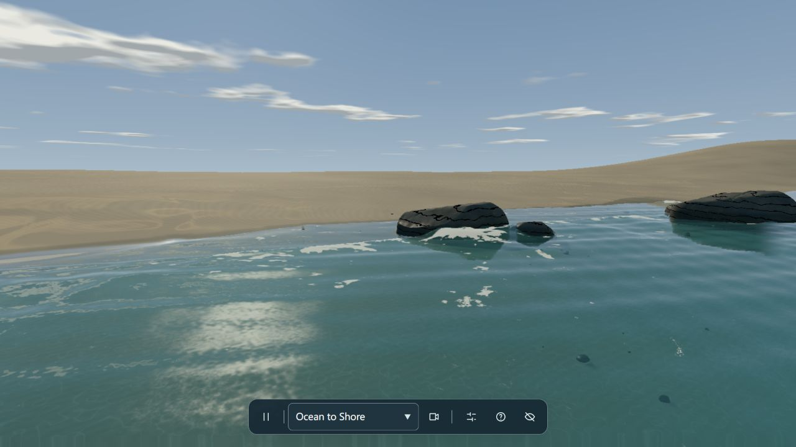
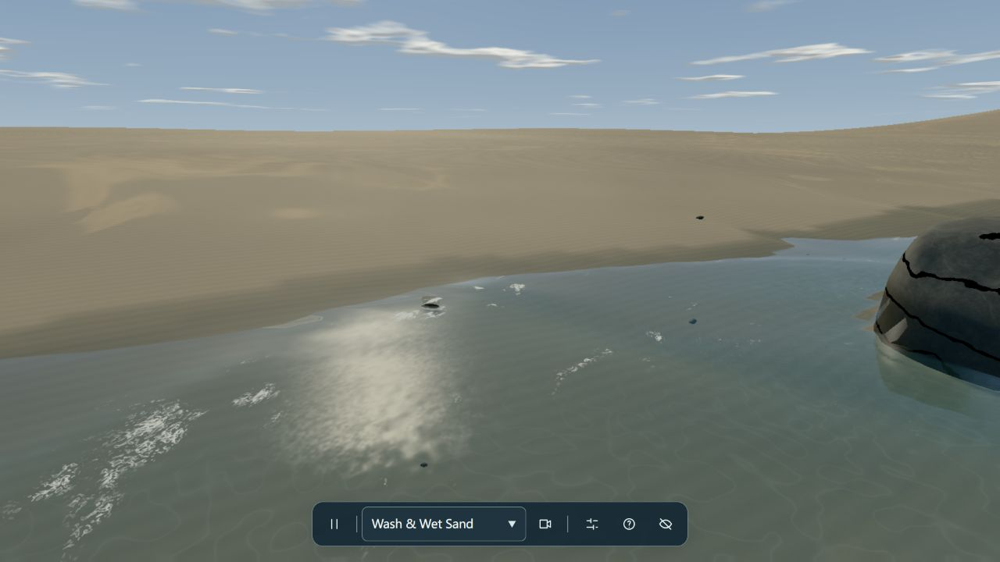

# 008 · coastal-simulation — 海岸浅水、泡沫与湿沙研究

围绕一个固定范围的浅水求解器，连接外海波浪、泡沫输运、湿沙材质与海岸漫游。它是一个可研究、可改造的完整演示项目。

[在线理解与演示](https://yydshly.github.io/0927_codex_project/008-coastal-simulation/#overview) · [返回总索引](../../README.md) · [原站演示](https://iamtechartist.github.io/coastal-simulation/?webgl=1) · [上游仓库](https://github.com/iamtechartist/coastal-simulation) · [另一个库：ShoreBreak](../009-shorebreak/README.md) · [本地展示页运行方式](web/README.md) · [研究记录](notes/research.md)

新增 [算法与场景实验室](../010-algorithm-scene-lab/README.md)：调整独立教学模型，做 A/B 对照、数值检查和场景迁移实验。

另见 [三页统一理解汇总](../010-algorithm-scene-lab/notes/synthesis.md) 与 [算法、效果、场景和扩展总图](../010-algorithm-scene-lab/assets/water-algorithm-map.svg)。

## 五项摘要

**呈现效果：**连续的海岸浪涌、绕石白沫、冲滩回流、浅水透明度、湿沙反光与接触水花，重点呈现水流和地面的连贯变化。

**内部模块：**四组解析波、固定网格浅水、泡沫生成与输运、水膜与湿度、光学与程序材质、喷溅、环境及相机；Worker 与可选 Wasm 负责流动计算。

**使用场景：**海岸视觉展示、图形算法教学、景观水体原型、浅水与湿润材质研究。

**可扩展产品方向：**可开发可调海岸展厅、浅水效果组件、湿地表材质编辑器或交互教学课程；需补齐模块接口、场景导入、预设管理和设备适配。

**对我的意义：**看懂浪、水流、泡沫、湿痕与光线怎样连接，形成可带到湖池、沟渠和雨后地面的算法复用方法。

## 理解总图


这是一张独立整理的教学总图，不是模拟器输出。网页可逐步查看原理，并按用途对比两个库。

## 能力展示

| 能力 | 实现与呈现 | 证据 |
| --- | --- | --- |
| 浪涌与冲滩 | 外海波动驱动近岸水体，水沿坡面上冲、退回，岸线随水位移动。 | 源码确认；`simulation.js · coast.js` |
| 岩石与水流 | 岩石同时进入可见场景和水力地形，水流会被阻挡；低处可以被越过。 | 源码确认；`coast.js · world.js` |
| 随流泡沫 | 根据水面陡度、流动压缩和撞击生成白沫，记录新旧泡沫并让纹理随水流移动。 | 源码确认；`simulation.js · shading.js` |
| 湿沙与水膜 | 水膜较快消退，吸收的湿度较慢衰减，形成退水后的反光与深色痕迹。 | 源码确认；`simulation.js · shading.js` |
| 反射、折射与喷溅 | 水面随深度改变透明度和颜色；岩石接触位置触发少量弹道喷溅粒子。 | 源码确认；`shading.js · spray.js` |
| 可调环境与漫游 | 调节浪强、风向、潮位、云量和光照；行走、切换八个预设视角或播放慢速镜头。 | 页面与源码确认；`main.js · camera.js` |

## 实际效果



原站实拍 · Ocean to Shore 视角。水面反射、白沫、浅水可见的滩底与岩石共同构成画面。



原站实拍 · Wash & Wet Sand 视角。可以观察薄水边缘、泡沫残留和岸边的明暗过渡。

截图于 2026-09-27 在 Codex 内置浏览器采集，保留原站画面与界面，未用生成图片代替实测结果。截图归属上游作者；详情见 [图片来源](assets/README.md)。

| 观察项 | 状态 | 记录 |
| --- | --- | --- |
| 海岸整体画面 | 可见 | WebGL 2 入口成功显示水面、泡沫、岩石与沙滩，已保存实际截图。 |
| 视角切换与湿沙观察 | 已操作 | 通过原站视角切换进入 Wash & Wet Sand，已保存第二张截图。 |
| 水力与喷溅机制 | 源码确认 | 已阅读流量限制、泡沫输运和岩石喷溅代码；未对每一种海况逐项实测。 |
| 性能与数值准确性 | 未基准测试 | 没有统一硬件帧率、长时间守恒误差或跨浏览器兼容性结论。 |

## 实现原理

### 1. 外海波浪输入 · 解析模型

不同振幅、频率、方向和相位的四组波叠加，再用缓慢变化的波群调制。模拟边界把水面和流速逐渐引向这组外海条件。

**可见效果：**浪不会很快重复成同一个短循环；调整浪强、潮位后，近岸水体逐渐响应。

[实现：WAVES / incoming / prepareBoundary](https://github.com/iamtechartist/coastal-simulation/blob/2e95e1a3e757ca1268247417dee01606e5e3d55c/src/coast.js)

### 2. 计算浅水流动 · 数值模拟

固定网格记录水深和两个水平方向的流速。水面高度差产生压力驱动，相邻单元的通量搬运水量；限制流出量以避免湿干边界出现负水深。

**可见效果：**水能沿坡面冲滩、退水和绕石流动。海床固定，不包含沙滩侵蚀或泥沙地形变化。

[实现：ShoreSimulation.step](https://github.com/iamtechartist/coastal-simulation/blob/2e95e1a3e757ca1268247417dee01606e5e3d55c/src/simulation.js)

### 3. 输运泡沫与湿度 · 状态更新

根据陡度、压缩和接触撞击产生泡沫，用速度场回溯采样实现输运。新旧泡沫衰减不同；沙滩分别保存较快排水的水膜和较慢消退的湿度。

**可见效果：**白沫会移动和变薄；水退去后，沙滩仍可保持暗色与短暂反光。

[实现：ShoreSimulation.transport](https://github.com/iamtechartist/coastal-simulation/blob/2e95e1a3e757ca1268247417dee01606e5e3d55c/src/simulation.js)

### 4. 重建与绘制水面 · 图形渲染

Worker 将水面、材质和流速打包成纹理数据。主线程插值相邻结果，用 TSL 材质组合反射、折射、颜色吸收、微波纹和泡沫覆盖。

**可见效果：**表现清浅海水与连贯的移动岸线。主体水面每个水平位置只有一个高度，无法直接形成翻卷水幕的空气腔。

[实现：createShading / packSurface](https://github.com/iamtechartist/coastal-simulation/blob/2e95e1a3e757ca1268247417dee01606e5e3d55c/src/shading.js)

图中曲线仅解释数据如何流动，不是上游求解器的实时计算结果。主模拟约 60 Hz，泡沫输运约 30 Hz；渲染帧率由实际设备决定。

## 使用场景与个人价值

- **学习与讲解：**沿着输入、流动、输运、渲染四步阅读代码，理解每一层如何影响画面。
- **海岸展示：**用于文旅页面、展陈或海边氛围原型；先在目标终端测试加载与操控。
- **效果模块研究：**抽取湿沙、泡沫输运或岩石接触效果，再与自己的地形和材质系统适配。

对已有 Three.js 研究的补充是：从“如何画三维物体”进入“如何让状态随时间演化，并驱动画面”。先研究流动、泡沫与材质之间的数据连接，再决定是否拆成自己的效果模块。

### 可扩展方向

可进一步加入地形导入、可复现的海况预设、性能统计和设备质量档位。翻卷浪头、侵蚀和交互物体对水体的双向作用需要新的模型，不能只改材质获得。

## 能力边界

- 主体是二维平面上的水深与水平速度，属于高度场；没有完整三维流体体积。
- 没有独立的翻卷浪唇、浪腔与游泳潜水渲染系统。
- 解析外海、数值耗散、细水排出和视觉纹理都包含实时图形近似。
- 网格、海床和岩石布局为特定场景设计；导入任意海岸并非现成接口。
- 未经过海岸防灾、侵蚀或工程预测验证；更丰富的画面也不等于更准确的物理。

## 两个库如何选择

| 目标 | 更合适的起点 |
| --- | --- |
| 学习浅水流动、泡沫输运、湿沙材质 | coastal-simulation |
| 展示翻卷浪唇、落水冲击、水下气泡 | ShoreBreak |
| 行走、游泳、潜水的完整海岸体验 | ShoreBreak |
| 调整海况、光照和预设镜头 | coastal-simulation |
| 防灾、侵蚀或工程预测 | 两者都不能直接承担，需要经过验证的模型与数据 |

这属于基于架构的选型建议，不是同一硬件下的速度排名。两者都更接近完整演示项目，而非具有稳定集成接口的通用 SDK。

## 运行条件与方法

- 支持 WebGPU 或 WebGL 2 的现代浏览器，建议启用硬件加速。
- 原站默认使用 WebGPU 渲染路径；本次用 ?webgl=1 兼容入口完成观察。
- 本研究页为独立静态网页，无需安装 Three.js；加载原站演示仍需要网络和图形能力。
- 上游为原生 ES modules 与随仓库提供的 vendor 文件，需要 HTTP 服务；没有 npm 构建步骤。

以下运行所研究的固定上游提交；本次仅阅读源码并观察官方在线演示，没有在本机安装或构建上游。

```sh
git clone https://github.com/iamtechartist/coastal-simulation.git
cd coastal-simulation
git checkout 2e95e1a3e757ca1268247417dee01606e5e3d55c
python -m http.server 8080
# 浏览器打开 http://localhost:8080/?webgl=1
```

### 上游控制

| 操作 | 功能 |
| --- | --- |
| 拖动 / WASD / 方向键 | 转向与移动 |
| Space / C / H | 暂停 / 预设视角 / 隐藏界面 |
| Conditions | 浪强、风向、潮位、云量、光照、画质 |
| 电影镜头按钮 | 播放缓慢的海岸镜头 |

## 版本、来源与许可

- 研究日期：2026-09-27
- 固定提交：[`2e95e1a3e757ca1268247417dee01606e5e3d55c`](https://github.com/iamtechartist/coastal-simulation/tree/2e95e1a3e757ca1268247417dee01606e5e3d55c)
- 上游作者：Techartist / iamtechartist
- 原站演示可能随作者发布而变化，尚未确认部署与上述提交逐字一致。

上游项目代码为 MIT（Copyright 2026 Techartist）。本项目没有复制或打包上游运行代码；引用的原站截图保留作者署名与来源。复用 vendor 文件时还应保留其许可证。

| 资料 | 用途 |
| --- | --- |
| [项目说明](https://github.com/iamtechartist/coastal-simulation/blob/2e95e1a3e757ca1268247417dee01606e5e3d55c/README.md) | 项目定位和官方演示入口 |
| [地形与入射波](https://github.com/iamtechartist/coastal-simulation/blob/2e95e1a3e757ca1268247417dee01606e5e3d55c/src/coast.js) | 网格、地形、岩石、四组外海波 |
| [浅水求解器](https://github.com/iamtechartist/coastal-simulation/blob/2e95e1a3e757ca1268247417dee01606e5e3d55c/src/simulation.js) | 压力、通量、湿干边界与泡沫输运 |
| [Worker 与时间步](https://github.com/iamtechartist/coastal-simulation/blob/2e95e1a3e757ca1268247417dee01606e5e3d55c/src/worker.js) | 60 Hz 推进、状态预热与数据传递 |
| [Wasm 加速与回退](https://github.com/iamtechartist/coastal-simulation/blob/2e95e1a3e757ca1268247417dee01606e5e3d55c/src/solver-accelerator.js) | 算术内核与 Wasm 内存视图 |
| [水面重建](https://github.com/iamtechartist/coastal-simulation/blob/2e95e1a3e757ca1268247417dee01606e5e3d55c/src/surface.js) | 湿干边界与可见水面一致性 |
| [水体与地表材质](https://github.com/iamtechartist/coastal-simulation/blob/2e95e1a3e757ca1268247417dee01606e5e3d55c/src/shading.js) | 反射、折射、吸收、泡沫与湿沙 |
| [接触喷溅](https://github.com/iamtechartist/coastal-simulation/blob/2e95e1a3e757ca1268247417dee01606e5e3d55c/src/spray.js) | 岩石接触触发的粒子 |
| [相机与探索](https://github.com/iamtechartist/coastal-simulation/blob/2e95e1a3e757ca1268247417dee01606e5e3d55c/src/camera.js) | 视角、行走与相机高度限制 |
| [界面与渲染器](https://github.com/iamtechartist/coastal-simulation/blob/2e95e1a3e757ca1268247417dee01606e5e3d55c/src/main.js) | Three.js r185、后端选择与环境控制 |
| [许可证](https://github.com/iamtechartist/coastal-simulation/blob/2e95e1a3e757ca1268247417dee01606e5e3d55c/LICENSE) | MIT 与作者信息 |

## 本项目交付

- 完整研究说明、固定提交的源码入口与来源记录。
- 两张原站截图和可放大的 SVG 原理总图。
- 中文静态展示页：截图切换、四步原理、用途选择、上游演示加载与停止、命令复制。
- 本地静态构建与既有 GitHub Pages 汇总构建兼容；演示网址在实际发布后再填写。
