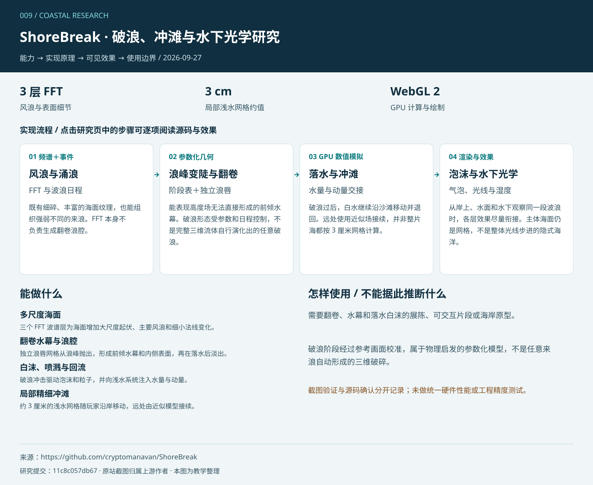
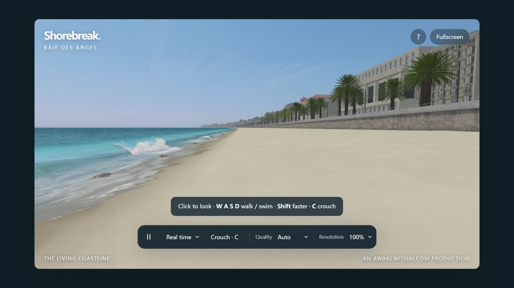
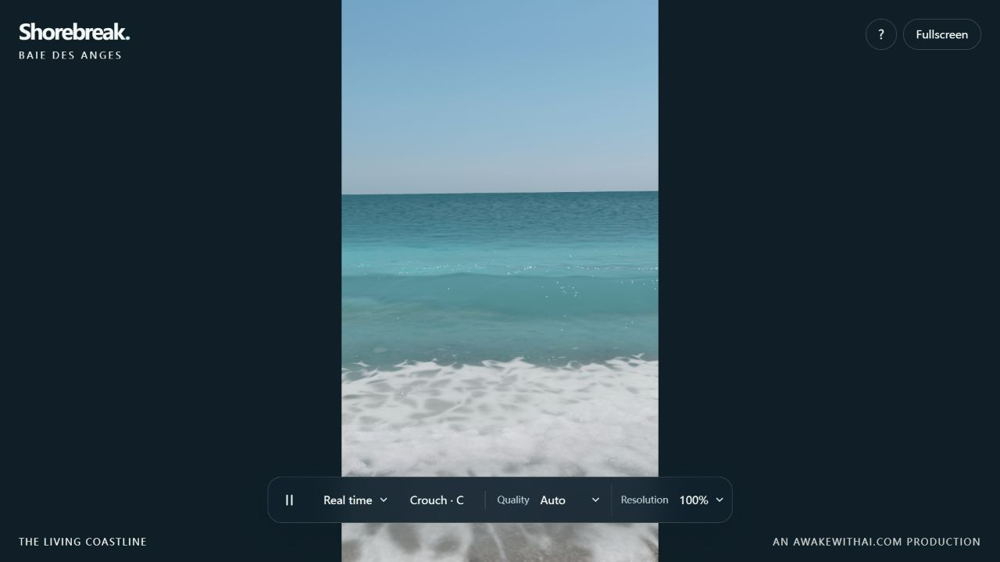

# 009 · ShoreBreak — 破浪、冲滩与水下光学研究

多尺度风浪、参数化破浪、独立浪唇网格和 GPU 浅水求解器各管一段，再用共同的时间、地形和水面状态把它们衔接起来。

[在线理解与演示](https://yydshly.github.io/0927_codex_project/009-shorebreak/#overview) · [返回总索引](../../README.md) · [原站演示](https://shorebreak-living-coast.netlify.app/) · [上游仓库](https://github.com/cryptomanavan/ShoreBreak) · [另一个库：coastal-simulation](../008-coastal-simulation/README.md) · [本地展示页运行方式](web/README.md) · [研究记录](notes/research.md)

新增 [算法与场景实验室](../010-algorithm-scene-lab/README.md)：调整独立教学模型，做 A/B 对照、数值检查和场景迁移实验。

另见 [三页统一理解汇总](../010-algorithm-scene-lab/notes/synthesis.md) 与 [算法、效果、场景和扩展总图](../010-algorithm-scene-lab/assets/water-algorithm-map.svg)。

## 五项摘要

**呈现效果：**多尺度海浪、向前翻卷的水幕与浪腔、落水白沫、精细冲滩、湿岩石以及水下气泡与朦胧感；强调近景破浪与漫游。

**内部模块：**三层 FFT 风浪、事件破浪、独立浪唇网格、GPU 浅水、白水与喷溅、地形和湿度、水面与水下光学、行走游泳及质量控制。

**使用场景：**沉浸海岸互动、冲浪视觉镜头、水下体验、游戏与景观场景预演、图形学学习。

**可扩展产品方向：**可开发海岸漫游展厅、可控破浪镜头工具、水下视觉组件或效果调试台；需完善资产许可、模块接口、编辑器、触控与设备分级。

**对我的意义：**理解高度场、独立几何、粒子和局部体积各自的能力边界，学会按目标拆分系统、连接状态并评估移植成本。

## 理解总图



这是一张独立整理的教学总图，不是模拟器输出。网页可逐步查看原理，并按用途对比两个库。

## 能力展示

| 能力 | 实现与呈现 | 证据 |
| --- | --- | --- |
| 多尺度海面 | 三个 FFT 波谱层为海面增加大尺度起伏、主要风浪和细小法线变化。 | 源码确认；`OceanFFT.js` |
| 翻卷水幕与浪腔 | 独立浪唇网格从浪峰抛出，形成前倾水幕和内侧表面，再在落水后淡出。 | 源码确认；`breaker.js · LipRibbon.js` |
| 白沫、喷溅与回流 | 破浪冲击驱动泡沫和粒子，并向浅水系统注入水量与动量。 | 源码确认；`Whitewater.js · SwashSim.js` |
| 局部精细冲滩 | 约 3 厘米的浅水网格随玩家沿岸移动，远处由近似模型接续。 | 源码确认；`SwashSim.js` |
| 水下体验 | 支持水面下的光学、焦散、气泡与局部浑浊体积效果，并提供游泳和下潜视角。 | 文档与源码确认；`underwater.js · UnderwaterPlume.js` |
| 完整海岸环境 | 海滨建筑、棕榈树、沙滩和岩石，加上行走、蹲下、游泳、慢放与画质控制。 | 页面与源码确认；`beach/ · explore.js` |

## 实际效果



原站实拍 · 默认漫游视角。浅色沙滩、青绿色海水、岸线白沫与海滨建筑同处一个场景。



原站实拍 · ?clip 固定视角。用于观察近岸波形与冲滩；单张截图不证明完整破浪周期或物理准确性。

截图于 2026-09-27 在 Codex 内置浏览器采集，保留原站画面与界面，未用生成图片代替实测结果。截图归属上游作者；详情见 [图片来源](assets/README.md)。

| 观察项 | 状态 | 记录 |
| --- | --- | --- |
| 默认海岸场景 | 可见 | 默认演示完成加载，海水、岸线白沫、沙滩、建筑和棕榈树可见，已保存实拍。 |
| 固定近岸视角 | 已打开 | 打开 ?clip 入口记录近岸画面，便于与漫游全景对照。 |
| 翻卷、水下与游泳 | 文档与源码确认 | 已核对相关模块；本次未逐项完整体验潜水、游泳和所有破浪阶段。 |
| 性能与精度 | 未基准测试 | 没有统一硬件 FPS 或物理准确性验证；上游发布检查也不构成跨设备性能保证。 |

## 实现原理

### 1. 风浪与涌浪 · 频谱＋事件

Tessendorf 思路的 GPU FFT 使用 JONSWAP 波谱生成三个尺度的风浪。较大的涌浪另由确定性波浪事件控制，沿水深变化传播。

**可见效果：**既有细碎、丰富的海面纹理，也能组织强弱不同的来浪。FFT 本身不负责生成翻卷浪腔。

[实现：OceanFFT / Schedule / Swell](https://github.com/cryptomanavan/ShoreBreak/blob/11c8c057db671628ef2dbc308ab9fe0f233f48dc/src/water/OceanFFT.js)

### 2. 浪峰变陡与翻卷 · 参数化几何

预定的阶段表控制浪峰高度、前缘陡度和撞击时刻。独立的 LipRibbon 网格补出水幕外侧、内侧与浪腔，浪唇沿弹道式轨迹下落。

**可见效果：**能表现高度场无法直接形成的前倾水幕。破浪形态受参数和日程控制，不是完整三维流体自行演化出的任意破浪。

[实现：BK_TABLE / brkLip / LipRibbon](https://github.com/cryptomanavan/ShoreBreak/blob/11c8c057db671628ef2dbc308ab9fe0f233f48dc/src/water/LipRibbon.js)

### 3. 落水与冲滩 · GPU 数值模拟

撞击时把水量和动量注入浅水系统。GPU 有限体积求解器处理湿干边界、底部摩擦、渗水、上冲和回流；近处用随玩家移动的精细网格。

**可见效果：**破浪过后，白水继续沿沙滩移动并退回。远处使用近似场接续，并非整片海都按 3 厘米网格计算。

[实现：central-upwind flux / sources / foam](https://github.com/cryptomanavan/ShoreBreak/blob/11c8c057db671628ef2dbc308ab9fe0f233f48dc/src/swash/SwashSim.js)

### 4. 泡沫与水下光学 · 渲染与效果

水面、浪唇、喷溅与水下效果共享时间和水面字段。局部体积步进表现卷入水中的气泡云，岩石独立保存快排水膜与慢干湿度。

**可见效果：**从岸上、水面和水下观察同一段波浪时，各层效果尽量衔接。主体海面仍是网格，不是整体光线步进的隐式海洋。

[实现：UnderwaterPlume / RockWetness](https://github.com/cryptomanavan/ShoreBreak/blob/11c8c057db671628ef2dbc308ab9fe0f233f48dc/src/water/UnderwaterPlume.js)

流程图是教学示意。翻卷水幕来自参数化几何，冲滩来自浅水计算，水下气泡云来自渲染近似；三者都不等同于完整三维流体。

## 使用场景与个人价值

- **近景海浪展示：**需要翻卷、水幕和落水白沫的展陈、可交互片段或海岸原型。
- **沉浸漫游：**用行走、涉水和水下视角验证海边游览体验；移动端需单独测试。
- **图形学研究：**学习 FFT、网格破浪、浅水求解与体积效果怎样分工和共享状态。

对已有 Three.js 研究的补充是：一个可信的视觉体验往往由不同模型拼接完成。研究它的价值在于识别每层负责什么、怎样共享状态、边界在哪里，再按产品需求选择要复用的部分。

### 可扩展方向

可尝试更换海滨资产、形成确定性镜头与海况预设、拆分浪唇或水下模块，并建立画质与帧时间基准。真实海岸测绘、船体浮力、海岸侵蚀和工程预测均需另行实现。

## 能力边界

- 破浪阶段经过参考画面校准，属于物理启发的参数化模型，不是任意来浪自动形成的三维破碎。
- 主体海面与浪唇采用网格；只有局部水下气泡云等效果使用体积步进。
- GPU 浅水网格仅覆盖局部窗口，远处使用近似模型；细网格不代表全海岸工程精度。
- 环境是艺术化海滨场景，不是尼斯实测地理重建。
- 水面、浪唇、泡沫、地形与预热流程存在耦合，拆成通用 SDK 需要重构与测试。

## 两个库如何选择

| 目标 | 更合适的起点 |
| --- | --- |
| 学习浅水流动、泡沫输运、湿沙材质 | coastal-simulation |
| 展示翻卷浪唇、落水冲击、水下气泡 | ShoreBreak |
| 行走、游泳、潜水的完整海岸体验 | ShoreBreak |
| 调整海况、光照和预设镜头 | coastal-simulation |
| 防灾、侵蚀或工程预测 | 两者都不能直接承担，需要经过验证的模型与数据 |

这属于基于架构的选型建议，不是同一硬件下的速度排名。两者都更接近完整演示项目，而非具有稳定集成接口的通用 SDK。

## 运行条件与方法

- 现代浏览器、WebGL 2、硬件加速和浮点渲染目标；上游建议具备较强 GPU 的桌面设备。
- 上游开发与构建要求 Node.js 24.x。安装依赖需要网络，无需 API key 或额外购买素材。
- 启动时会加载资源、编译着色器并预热场景；Auto 主要调整渲染像素预算，流体网格分辨率保持固定。
- 本研究页无需安装 Node.js 或 Three.js；只有运行上游源码才需要其开发环境。

以下运行所研究的固定上游提交；本次仅阅读源码并观察官方在线演示，没有在本机安装或构建上游。

```sh
git clone https://github.com/cryptomanavan/ShoreBreak.git
cd ShoreBreak
git checkout 11c8c057db671628ef2dbc308ab9fe0f233f48dc
# 使用 Node.js 24.x
npm ci
npm run dev
# 校验与构建：npm test / npm run licenses:check / npm run build
```

### 上游控制

| 操作 | 功能 |
| --- | --- |
| 点击 / WASD / Shift | 捕获鼠标 / 行走或游泳 / 加速 |
| C / Space | 蹲下或下潜 / 陆地跳跃 |
| P / 1、2、3 / R | 暂停 / 实时与慢放 / 重启浪序列 |
| F / H / U / Esc | 全屏 / 帮助 / 隐藏界面 / 释放鼠标 |

## 版本、来源与许可

- 研究日期：2026-09-27
- 固定提交：[`11c8c057db671628ef2dbc308ab9fe0f233f48dc`](https://github.com/cryptomanavan/ShoreBreak/tree/11c8c057db671628ef2dbc308ab9fe0f233f48dc)
- 上游作者：Christopher Canavan / awakewithai.com
- 原站演示可能随作者发布而变化，尚未确认部署与上述提交逐字一致。

上游原创代码、程序化几何和文档采用 MIT；摄影材质保留 CC0-1.0，第三方组件沿用各自许可证。素材源与校验清单见 ASSETS.md 和 THIRD_PARTY_NOTICES.md。本项目只引用截图和源码链接。

| 资料 | 用途 |
| --- | --- |
| [项目与运行说明](https://github.com/cryptomanavan/ShoreBreak/blob/11c8c057db671628ef2dbc308ab9fe0f233f48dc/README.md) | 功能、环境、控制方式与明确限制 |
| [架构说明](https://github.com/cryptomanavan/ShoreBreak/blob/11c8c057db671628ef2dbc308ab9fe0f233f48dc/docs/ARCHITECTURE.md) | 模块分工、耦合与模型边界 |
| [FFT 风浪](https://github.com/cryptomanavan/ShoreBreak/blob/11c8c057db671628ef2dbc308ab9fe0f233f48dc/src/water/OceanFFT.js) | Tessendorf、JONSWAP 与三层频谱 |
| [破浪阶段模型](https://github.com/cryptomanavan/ShoreBreak/blob/11c8c057db671628ef2dbc308ab9fe0f233f48dc/src/glsl/breaker.js) | 阶段表、形态与注入衔接 |
| [翻卷浪唇网格](https://github.com/cryptomanavan/ShoreBreak/blob/11c8c057db671628ef2dbc308ab9fe0f233f48dc/src/water/LipRibbon.js) | 浪唇、水幕与浪腔几何 |
| [GPU 浅水求解](https://github.com/cryptomanavan/ShoreBreak/blob/11c8c057db671628ef2dbc308ab9fe0f233f48dc/src/swash/SwashSim.js) | 有限体积法、移动窗口和远场近似 |
| [水下体积效果](https://github.com/cryptomanavan/ShoreBreak/blob/11c8c057db671628ef2dbc308ab9fe0f233f48dc/src/water/UnderwaterPlume.js) | 气泡与局部体积步进 |
| [岩石湿度](https://github.com/cryptomanavan/ShoreBreak/blob/11c8c057db671628ef2dbc308ab9fe0f233f48dc/src/beach/RockWetness.js) | 表面水膜和吸收湿度 |
| [环境与网格配置](https://github.com/cryptomanavan/ShoreBreak/blob/11c8c057db671628ef2dbc308ab9fe0f233f48dc/src/config.js) | 时间步、海床和网格参数 |
| [发布验证](https://github.com/cryptomanavan/ShoreBreak/blob/11c8c057db671628ef2dbc308ab9fe0f233f48dc/docs/RELEASE-VALIDATION.md) | 上游记录的测试与性能证据边界 |
| [素材来源](https://github.com/cryptomanavan/ShoreBreak/blob/11c8c057db671628ef2dbc308ab9fe0f233f48dc/ASSETS.md) | 素材归属与许可 |
| [第三方说明](https://github.com/cryptomanavan/ShoreBreak/blob/11c8c057db671628ef2dbc308ab9fe0f233f48dc/THIRD_PARTY_NOTICES.md) | 第三方组件许可 |
| [许可证](https://github.com/cryptomanavan/ShoreBreak/blob/11c8c057db671628ef2dbc308ab9fe0f233f48dc/LICENSE) | 原创代码 MIT |

## 本项目交付

- 完整研究说明、固定提交的源码入口与来源记录。
- 两张原站截图和可放大的 SVG 原理总图。
- 中文静态展示页：截图切换、四步原理、用途选择、上游演示加载与停止、命令复制。
- 本地静态构建与既有 GitHub Pages 汇总构建兼容；演示网址在实际发布后再填写。
