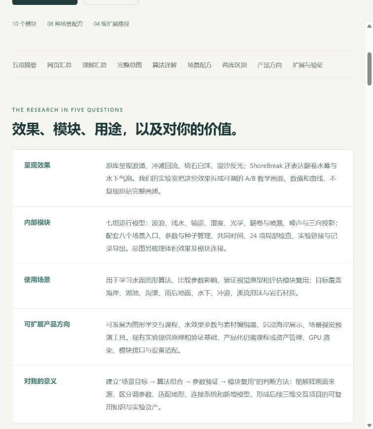

# 发布记录

2026-09-27 已完成 GitHub Pages 部署与公网验证。

- [统一理解与产品方向](https://yydshly.github.io/0927_codex_project/010-algorithm-scene-lab/summary.html)
- [coastal-simulation 研究页](https://yydshly.github.io/0927_codex_project/008-coastal-simulation/#overview)
- [ShoreBreak 研究页](https://yydshly.github.io/0927_codex_project/009-shorebreak/#overview)
- [七组 A/B 实验](https://yydshly.github.io/0927_codex_project/010-algorithm-scene-lab/#workspace)
- [完整引导图 SVG](https://yydshly.github.io/0927_codex_project/010-algorithm-scene-lab/assets/water-algorithm-map.svg)
- [首次成功部署](https://github.com/yydshly/0927_codex_project/actions/runs/36315076602)，源码提交 `30d9cbd6c5a474837751c14b2550396d3f5a27cf`。

## 摘要与范围

按呈现效果、内部模块、使用场景、可扩展产品方向和对我的意义组织三个项目的摘要。010 同时在统一理解页展示五项完整说明，补充交互课程、水效果编辑器、沉浸海岸展厅和场景视觉预演四个方向的已有基础与待补能力。

首次发布加入 008 / 009 / 010，保留原有七个网页。未包含本地其他进行中的新项目。010 首页引导图沿用此前生成的统一总图，未重绘；两种格式分别用于放大阅读和高清保存。

## 验证结果

- 共享摘要与导航的 11 项单元检查通过；新增本地 HTML 入口仍禁止外部网址、路径穿越与任意查询参数。
- 七组教学模型及 60 秒浅水推进共八个测试组通过；完整十项目构建通过。
- 五个相关静态页面的 155 个本地链接、资源与锚点通过。
- Pages 的 build 和 deploy 均成功，GitHub Check project index 工作流通过。
- 11 个正式网页与资源返回 HTTP 200，包括站点首页、008、009、010 汇总与实验页、脚本、样式、PNG、SVG 和首页封面。
- 线上统一 SVG 与首页封面 SVG 均和原图字节一致：SHA256 `c8d70a618887ee26f1db6f8f7748f21e9be62209c34d0a5518ea8e0981cebda2`。
- 正式汇总页显示五项摘要和四个产品方向，四张图片均加载，控制台无错误。
- 通过键盘操作验证正式页总图 100% 缩放为 2400 px，并恢复适合宽度；汇总页可进入实验室并返回。
- 正式波浪实验应用“振幅加倍”后，A/B 的 RMS 为 0.240 / 0.480，当前四项数学检查全部通过。

浏览器指针自动化在公网复核时未触发部分控件，改用同一浏览器的键盘操作确认了响应；不据此认定网页指针交互存在缺陷。

本次没有重复检验上游原站的完整破浪与潜水流程，也没有工程精度或跨设备性能认证。网页区分上游真实效果、独立教学模型和后续开发建议。

