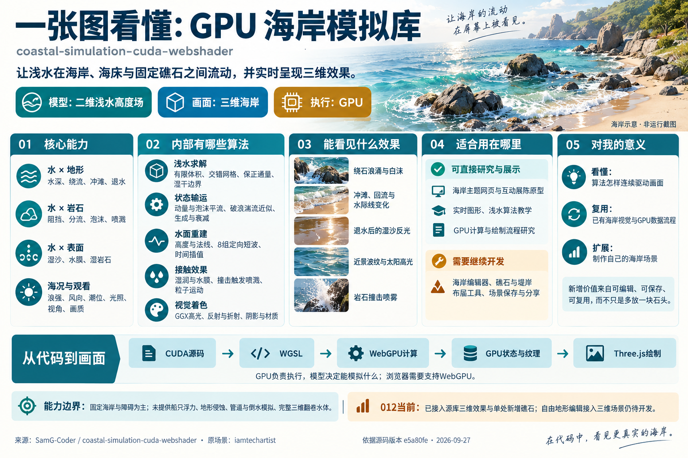
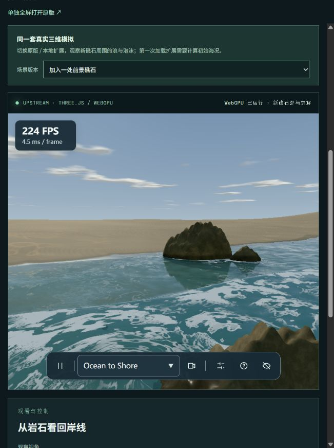

# 012 · coastal-simulation GPU 海岸能力研究

> 这是海岸浅水与**固定**岩石、海床、岸线的互动模拟。水受阻后绕石、冲滩、退回；岩石不会被水推动。画面表现为连续的浪、白沫、细波、撞击喷雾与退水湿痕。计算由 CUDA WebShader 编译到 WebGPU 执行，Three.js 绘制三维海岸。

[正式 Web 展示](https://yydshly.github.io/0927_codex_project/012-coastal-simulation-cuda-webshader/#summary) · [三维演示](https://yydshly.github.io/0927_codex_project/012-coastal-simulation-cuda-webshader/extensions.html) · [返回总索引](../../README.md) · [本地展示页与交互实验台](web/README.md) · [官方在线演示](https://samg-coder.github.io/coastal-simulation-cuda-webshader/) · [上游仓库](https://github.com/SamG-Coder/coastal-simulation-cuda-webshader) · [研究笔记](notes/research.md)

**阅读顺序：**[能力总图与真实样例](https://yydshly.github.io/0927_codex_project/012-coastal-simulation-cuda-webshader/#guide-map) → [理解与应用结论](notes/understanding.md) → [运行与验证记录](notes/research.md)。提交范围、检查结果和建议说明见[提交范围与验收](notes/submission.md)。

## 一页摘要

| 问题 | 我们的理解 |
| --- | --- |
| 这个库做什么？ | 在固定海岸高度场中计算浅水与岩石、海床、岸线的接触、阻挡、绕流、冲滩和回流。岩石不动，也没有船只等移动物体的双向刚体碰撞。 |
| 效果怎样？ | 浪涌与流速变化带动白沫；撞岩处出现水滴、碎雾和薄雾；细波与反光增强近景；退水留下短时水膜、湿沙和湿岩石。真实画面见下方三张实拍。 |
| 内部模块有哪些？ | 地形/障碍与外海输入、浅水流动、破浪湍流与泡沫、表面重建与短波、湿润与喷溅、水面/岩石材质、GPU 资源调度、相机控制与诊断。 |
| 内部算法有哪些？ | 交错网格浅水更新、动量平流、保正水量通量、湿干处理、泡沫输运和衰减、八组定向短波、法线重建、GGX 高光、喷溅粒子更新。CUDA WebShader 把 CUDA 源编为 WGSL，WebGPU 并行执行，Three.js 绘制。 |
| 使用场景是什么？ | 互动海岸网页、展陈和视觉原型；浅水与实时图形教学；研究 GPU 计算到三维绘制的数据管线。它没有工程级海岸预测验证。 |
| 可以扩成什么产品？ | 海岸场景编辑器、可嵌入的互动海岸组件、可对照算法和参数的教学实验台。任意地形导入、预设保存、设备分级等仍需开发。 |
| 对我有什么意义？ | 从水流方程、GPU 状态和视觉算法一路追到最终画面；借用源库已经能运行的海岸效果，逐步制作可配置、可分享的自己的海岸场景。 |

## 核心结论

**这是一套海岸浅水模拟与三维视觉系统。模型决定能模拟什么，视觉算法决定呈现效果，GPU 负责并行执行。**“使用 GPU”不会自动获得真实感，也不代表可以处理所有与水有关的场景。

水与固定地形、礁石的互动是主要表现范围。当前高度场适合岸线、浅滩、沟槽和固定障碍；任意地形仍需接入适配，船只浮力、地形侵蚀、管道与倒水、完整三维翻卷水体需要额外模型。

这是 [原版 coastal-simulation](https://github.com/iamtechartist/coastal-simulation) 的移植与增强。原版已经由 Three.js 使用 GPU 绘制；新版把浅水求解、表面重建、材质/流速场打包和喷溅等动态计算放到 WebGPU，计算结果留在 GPU 并供 Three.js 使用。CUDA 源码由随项目提供的 CUDA WebShader 编译器转换为 WGSL，浏览器不运行原生 NVIDIA CUDA，也不需要 CUDA Toolkit。

移植版还增加了动量平流、持续的破浪湍流与泡沫、八组定向短波、改进的水面高光、岩石接触与喷溅表现。这些属于**模型和视觉改动**；减少 GPU 与 CPU 间的数据搬运属于**执行与数据流改动**。两类变化应分开评价。[上游 README：Port details](https://github.com/SamG-Coder/coastal-simulation-cuda-webshader#port-details)

## GPU 海岸模拟库能力总图



这张总图是我们对固定版本源码的整理，海岸配图为生成示意，帮助先看清能力与边界。下方三张实拍用于核对实际画面；完整图片均在[网页引导区](https://yydshly.github.io/0927_codex_project/012-coastal-simulation-cuda-webshader/#guide-map)可点击放大。

## 真实样例引导图

| GPU 移植版：新增礁石实测 | 原始库：Ocean to Shore | 原始库：Wash & Wet Sand |
| --- | --- | --- |
|  |  |  |

这些均为实际运行截图，分别标明移植版与原版；[网页引导区](https://yydshly.github.io/0927_codex_project/012-coastal-simulation-cuda-webshader/#guide-map)提供完整图注和原图链接。截图只是单帧，动态效果请打开[源库三维场景](https://yydshly.github.io/0927_codex_project/012-coastal-simulation-cuda-webshader/extensions.html)。来源与版本见[图片说明](assets/README.md)。另保留[算法数据路径图](assets/capability-map.svg)。能力总图中的海岸配图是生成示意，不作为运行证据。本站打包了固定版本上游运行包；可编辑地形仍是独立的简化 WebGPU 教学模型。

## 012 已完成什么

| 成果 | 当前状态与意义 |
| --- | --- |
| 中文能力导览、真实样例截图与源码研究 | 已完成固定版本整理；帮助理解源库能力、算法与边界 |
| 源库本地三维演示 | 已接入原求解和渲染，保留上游许可与来源 |
| 新增一处礁石 | 已验证共用岩石定义同时进入障碍、几何、湿润与喷雾；属于小型技术验证 |
| 二维地形数据诊断 | 独立简化模型，可编辑海床和障碍；不与源库三维场景共享状态 |
| 自由地形接入、完整场景编辑、保存与分享 | 待开发，是进一步增加可复用价值的方向 |

元数据中的“已完成”表示研究整理与上述原型验证完成；已完成公开部署与公网运行核验，详见[发布记录](notes/deployment.md)；完整场景编辑器和工程预测验证尚未完成。我们新增的产品能力仍有限，源库原有的水与岩石互动不计为 012 的原创能力。

## 全量能力清单

| 层次 | 能力 | 可见结果 / 实际作用 |
| --- | --- | --- |
| 海岸基础 | 程序化地形、岩石障碍、材料噪声、外海入射波与辐射边界 | 海浪进入固定海岸、绕岩石流动，边缘不被简单硬墙反射 |
| 浅水求解 | 交错网格流速、压力、保正水量输运、湿干交界、动量平流 | 冲滩、回流、绕流与水位变化；流动携带动量 |
| 破浪状态 | 陡峭波前/撞击产生的有界湍流储量、随流移动和耗散 | 白沫可在浪头经过后继续存在，岩石周围形成较连贯的泡沫 |
| 多尺度表面 | 八组定向短波、二次谐波、浅水/泡沫/边缘衰减、表面重建与法线 | 近景波峰与细碎波纹；短波仅改变表面细节，不增加物理水量 |
| 岸线与岩石 | 湿沙水膜与湿度衰减、岩石湿润、障碍场与可见几何对齐、隐藏实体内的水面外推 | 退水后的深色与反光、湿岩石、水面贴合岩壁的轮廓 |
| 喷溅与着色 | 撞击触发的水滴/碎雾/雾气、拖曳与淡出；GGX 太阳高光、清水与泡沫颜色 | 撞击喷雾、背光浪尖、粗糙度相关反光与更明亮的白沫 |
| GPU 数据流 | 21 个 CUDA 入口、GPU 常驻状态、GPU 重建/打包、共享资源与纹理拷贝 | 普通帧无需把九个模拟场读回 CPU 再上传；Three.js 继续负责场景和绘制 |
| 操控与诊断 | 海况、风向、潮位、云量、光照、画质；自由飞行、视角预设、暂停、FPS 与 `?profile` | 用户可探索和调参；研究者可核对后端、调度与资源指标 |

以上按功能分组，覆盖上游列出的 21 个 CUDA 入口和运行交互；它不是 21 个相互独立、可直接安装的产品模块。[上游 README：Enhanced waves 与 Port details](https://github.com/SamG-Coder/coastal-simulation-cuda-webshader#enhanced-waves)

## 实际效果与操作

2026-09-27 在 Codex 内置浏览器打开官方演示，页面报告 `backend: WebGPU`、`solver: CUDA WebShader / WebGPU`。**Rocky Surf** 视角可见海浪绕岩、岩石撞击喷溅和白沫；切到 **Shoreline** 可见浅水、浪面细节和水际线；**Along the Breaker** 可见近景泡沫与喷雾。页面在该环境成功运行，但没有以统一设备、分辨率、时长和海况做性能基准，瞬时 FPS 不作为结论。详细记录见 [研究笔记](notes/research.md)。

拖动鼠标观察；WASD/方向键移动，E/Q 升降，Shift 加速，滚轮前后移动；C 切换视角，空格暂停，H 隐藏界面。手动飞行不提供地形碰撞或高度限制。页面可调海况、风向、潮位、云量、光照与画质。[上游 README：Fly camera](https://github.com/SamG-Coder/coastal-simulation-cuda-webshader#fly-camera)

## 性能、验证与边界

| 证据 | 上游结果 | 应如何理解 |
| --- | --- | --- |
| 旧版数据路径对照 | GPU 求解后经 CPU 回读/重建/上传为 6.874 ms；GPU 常驻流程为 3.179 ms | 同机、完成 GPU 更新的受控流水线均值；约 2.16 倍，**不是整页 FPS 倍数** |
| 增强模型开销 | 增强模型 3.322 ms；参考 GPU 模型 3.253 ms | 两者接近；不能据此声称视觉增强提高速度 |
| 数值比较 | 完整网格 60 步对照中最大水深误差约 2.9×10⁻⁶ m | 作者在指定测试输入和硬件上的结果，不等于真实海岸预测精度 |
| 浏览器运行 | WebGPU 必需，无 CPU、Wasm 或 WebGL 回退 | 不支持 WebGPU 的设备会显示启动错误 |

上述数字均引用作者的[验证与性能说明](https://github.com/SamG-Coder/coastal-simulation-cuda-webshader#validation)，本站没有重新运行上游的数值套件或基准。主体模型仍是二维浅水高度场，不能生成完整三维翻卷水体；短波是渲染细节，湍流与泡沫耦合是视觉近似；也没有侵蚀、真实海底导入或工程预测验证。[上游模型边界](https://github.com/SamG-Coder/coastal-simulation-cuda-webshader#enhanced-waves)

## 使用场景、扩展与个人价值

- **展示与教学：**海岸主题网页、展陈原型、实时图形课程，适合展示“物理状态如何连续驱动画面”。先在目标浏览器验证 WebGPU 和加载成本。
- **架构研究：**把 [008 原版研究](../008-coastal-simulation/README.md) 的 Worker/Wasm 数据路径与本项目的 GPU 常驻路径并排比较；结合 [006 Three.js 研究](../006-threejs-gpu-rasterizer/README.md) 和 [011 CUDA WebShader 展厅](../011-cuda-webshader/README.md) 理解计算与绘制衔接。
- **可验证实验：**从 [010 算法与场景实验室](../010-algorithm-scene-lab/README.md) 选一个高度场或泡沫输运实验，用一致输入比较 CPU/手写 WGSL/CUDA WebShader 的数值和耗时。010 仍保持教学模型，不声称复刻本库。
- **产品扩展：**地形与障碍导入、可保存海况预设、质量档位、按设备测量加载/帧时间；船只/物体双向作用与三维翻卷浪头需要额外耦合或模型。

**研究价值最高的是 GPU 数据路径与视觉层的分工；直接复用成任意海岸 SDK 的准备度较低。**本库围绕一处固定场景、指定 Three.js r185 互操作适配和 WebGPU 能力设计。[源代码与依赖说明](https://github.com/SamG-Coder/coastal-simulation-cuda-webshader#port-details)

## 下一步扩展：可操作 GPU 实验台

`web/extensions.html` 有两个模式。默认模式在本站本地运行 [上游固定版本及本站小型补丁](web/upstream/INTEGRATION.md)的完整三维场景，提供视角、海况、潮位和画质控制，还可切换“原版 / 新增一处礁石”。新礁石在初始化前进入源库共用的岩石定义，使三维几何、GPU 障碍、湿润和喷雾使用同一位置；它会重启场景并重新计算初始海况。另一个模式是可编辑地形的独立原型：程序化海床或灰度高度图导入、拖动添加岩石、海况保存、三档网格与 P50/P95 帧时间对照。海床高度和障碍标记共用一份 GPU 数据，驱动求解与画面。水深、水平流速、泡沫由 WGSL 计算着色器更新，俯视水色与湿岸由 WGSL 绘制。

可编辑地形模式是验证扩展路径的简化浅水教学模型，并非上游 CUDA WebShader 求解器，不包含三维海岸、喷雾、短波或船只耦合。三维场景可增加本站预设的单处礁石，但任意高度图还未接入上游求解器；二维和三维的状态不互通。帧时间是浏览器画面间隔，不是 GPU 内核耗时；要做严格性能对照，还需固定设备、分辨率、输入、热身与采样时长。

## 本地展示页

在仓库根目录运行：

```sh
python projects/012-coastal-simulation-cuda-webshader/web/build.py
python -m http.server 4328 --bind 127.0.0.1 --directory dist
```

打开 `http://127.0.0.1:4328/012-coastal-simulation-cuda-webshader/`，再进入“体验源库三维场景”。研究说明和示意图离线可用；两个运行模式均需 WebGPU。上游运行源码与许可已随项目打包，无需从外站加载；可另开[官方在线版](https://samg-coder.github.io/coastal-simulation-cuda-webshader/)核对。

原项目与移植代码遵循 MIT 许可并保留来源归属；Three.js 与随仓库提供的 CUDA WebShader 各有许可与版本说明，复用时查看 [CREDITS.md](https://github.com/SamG-Coder/coastal-simulation-cuda-webshader/blob/main/CREDITS.md)。
