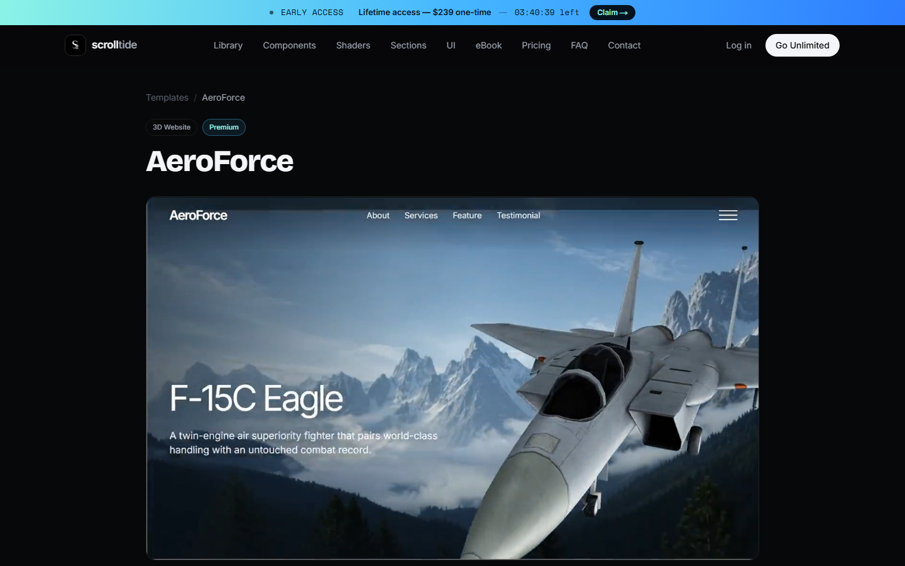
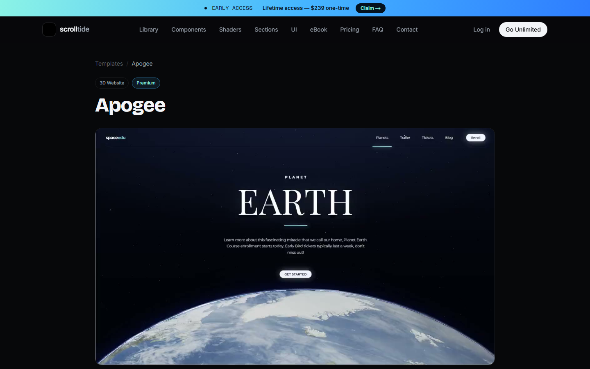
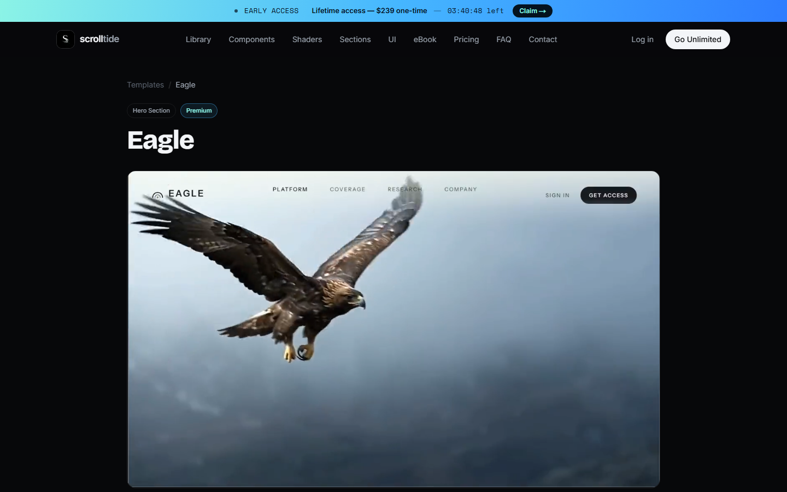
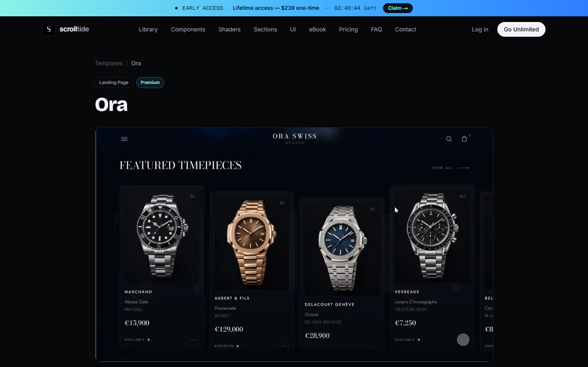

# 013 · Scrolltide 三维展示与动效实验室

本项目研究 [Scrolltide](https://www.scrolltide.co/) 的三维与电影感网页展示。Scrolltide 是动态网页模板、组件和 Shader 的作品库；我们依据公开样例的画面与说明，制作六种**原创、可操作**的技术演示。源站的付费模板代码并不在本项目内，因此下述“内部模块”和“算法”指**本站实现**；对源站实现的判断仅限于其公开描述。

[在线查看五张源站真实截图与六个互动实验](https://yydshly.github.io/0927_codex_project/013-scrolltide-motion-lab/#source-gallery)

## 一页摘要

| 问题 | 理解 |
| --- | --- |
| 能做什么 | 对比视频、图片序列、Three.js 实时三维、视频与三维叠层、CSS 3D 和 Shader 六条网页空间展示路线。 |
| 效果怎样 | 鹰迎面飞来、腕表随着滚动推进、酒瓶可自由转动、战机悬于航拍画面、卡片退入纵深、光场持续流动。 |
| 内部模块 | 源站真实样例引导、六个互动实验、画面来源与状态说明、操作控件、选型建议。 |
| 内部算法 | 时间轴播放、滚动进度到帧索引的映射、Three.js 模型与相机实时渲染、透明图层合成、CSS 透视变换、GLSL 逐像素着色。 |
| 使用场景 | 产品发布页、品牌叙事、作品集、数字展陈、交互教学和视觉原型。 |
| 可扩展方向 | 三维商品展示器、滚动叙事组件库、可复用的视觉模板、按设备性能调整的动效系统。 |
| 对我的意义 | 看到效果以后能分辨它来自预制影像还是真实三维，估计素材制作、实现和运行成本，再选产品路线。 |

## 引导图：Scrolltide 源站的优秀样例

以下为 2026-09-27 在 Scrolltide 公开样例页面直接截取的静态画面。截图展示的是**原作预览**，不是本站复刻的运行画面；单张图无法证明动画或底层技术，点击标题可看原作页面。本站的六个演示位于下方另一节。

| 原作与画面 | 观察重点 |
| --- | --- |
| [Vesper](https://www.scrolltide.co/templates/vesper)  | 产品占据画面中心，滚动改变三维模型姿态。 |
| [AeroForce](https://www.scrolltide.co/templates/aeroforce)  | 预制背景镜头与实时飞机叠合。 |
| [Apogee](https://www.scrolltide.co/templates/apogee)  | 相机、地球和光照组成连续的空间叙事。 |
| [Eagle](https://www.scrolltide.co/templates/eagle)  | 电影镜头也能制造很强的纵深感。 |
| [Ora](https://www.scrolltide.co/templates/ora)  | 逐帧素材让滚动精确控制产品镜头。 |

## 六个演示怎样验证

| 本站演示 | 操作 | 实际运行的技术 |
| --- | --- | --- |
| [Eagle](https://www.scrolltide.co/templates/eagle) | 暂停、重播、变速 | 原创 MP4 播放一次，网页文案独立叠加。 |
| [Ora](https://www.scrolltide.co/templates/ora) | 滚动、拖动画布或时间轴 | Canvas 从 72 张原创 WebP 中选择当前帧，可倒放。 |
| [Vesper](https://www.scrolltide.co/templates/vesper) | 拖动酒瓶、调节转速 | Three.js 实时绘制瓶身、标签、材质和光照。 |
| [AeroForce](https://www.scrolltide.co/templates/aeroforce) | 暂停背景、改变飞机远近 | 原创 MP4 背景与透明 Three.js 战机分层；源站原作的公开说明是逐帧背景。 |
| [Depth Carousel](https://www.scrolltide.co/components) | 切换卡片、调节纵深 | HTML 卡片以 CSS 透视、旋转、位移和模糊营造深度。 |
| [Tide Swirl](https://www.scrolltide.co/shaders) | 调节色相、速度、密度 | WebGL 片元着色器实时生成流动光场。 |

## 本地运行

在仓库根目录运行：

```sh
python projects/013-scrolltide-motion-lab/web/build.py
python -m http.server 4328 --bind 127.0.0.1 --directory dist
```

打开 `http://127.0.0.1:4328/013-scrolltide-motion-lab/`。演示资源均打包在项目内；链接到 Scrolltide 原作时才会访问外部网站。实时三维和 Shader 需要 WebGL，其他路线可以独立观看。重新制作视频与帧序列可运行 `web/make_cinematic_media.py`，需要 Pillow 与 ffmpeg。

素材来源、技术边界与验证记录见 [assets/README.md](assets/README.md) 和 [notes/research.md](notes/research.md)。
